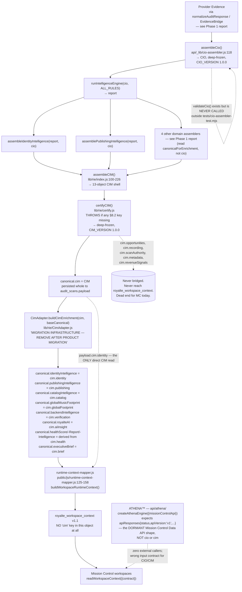

# Royaltē v3.0 Platform Certification™
## Phase 2 — Canonical Schema (CIO/CIM) Certification

**Initiative:** Royaltē v3.0 Platform Certification™
**Phase:** Foundation Certification, Phase 2 of 9
**Status:** Architecture Discovery complete — no code modified, no implementation performed
**Method:** Evidence-based. Every claim below cites a real file and line number. Where a claim could not be verified from the repository, it is marked **UNVERIFIED** rather than assumed.

---

## 1. Executive Summary

The CIO and CIM are each real, singly-owned, immutable, versioned objects with exactly one producer — that part of the architecture is sound and was confirmed independently in Phase 1. This phase went deeper into governance and consumption and found a more serious picture than Phase 1's scope covered:

- **The CIM's own structural certification is enforced (`certifyCIM()` throws on a missing key); the CIO's equivalent (`validateCio()`) is never called anywhere outside its own test file.** A malformed CIO can flow through the entire Intelligence Engine and every domain assembler with zero validation gate.
- **Mission Control does not read the CIM.** Despite the codebase's own comments repeatedly stating "Phase 3.2 (Mission Control) reads from cim directly" as the migration target, the live `royalte_workspace_context` (schema v1.1) reads 8 of 9 intelligence domains through `CimAdapter.js` — a module whose own header declares it "MIGRATION INFRASTRUCTURE — REMOVE AFTER PRODUCT MIGRATION... No future intelligence functionality may depend upon CimAdapter." The full `cim` object is never attached to `royalte_workspace_context` at all.
- **Five of the CIM's 13 constitutional objects never reach Mission Control under any name:** `opportunities`, `recording`, `scanAuthority`, `metadata`, `revenueSignals`. Recording Intelligence™ — a real, substantial domain with its own assembler, matcher, and confidence engine — is fully computed on every scan and then invisible to every product surface.
- **A second, complete, dormant "canonical" architecture exists in parallel** (`api/registry`, `api/resolution`, `api/normalization`, `api/orchestrator`, `api/mission-control-api`, `api/athena`, `api/executive-brief`, `api/mission-control-integration`) — independently re-verified this session (not assumed from memory) to have zero callers from the live CIO/CIM pipeline. ATHENA™ specifically is built against this dormant chain's Mission Control Data API response envelope, not against CIO/CIM — it cannot consume the certified canonical model without a new translation layer being built first.
- On the positive side: the CIO/CIM schema files themselves have zero circular dependencies, `CimAdapter.js` and `EvidenceBridge.js` are both pure, dependency-free, and honest about their own temporary status, and the two-object (CIO vs CIM) design is coherently documented and consistently applied where it is used.

---

## 2. Certification Rating

# 🟡 CERTIFIED WITH CONDITIONS

---

## 3. Executive Certification Summary

### Certification Scorecard

| Category | Status | Why |
|---|---|---|
| CIO Integrity | 🟡 | Single owner, immutable, versioned — but its structural validator (`validateCio()`) is never invoked in production. |
| CIM Integrity | 🟢 | Single owner, immutable, versioned, and structurally enforced — `certifyCIM()` throws on any missing §8.2 key. |
| Schema Ownership | 🟢 | No competing definitions of CIO or CIM anywhere in the live codebase; zero circular imports. |
| Mission Control Compatibility | 🔴 | MC does not read the CIM. 8 of 9 intelligence domains flow through temporary bridge infrastructure (`CimAdapter.js`) that is explicitly marked for removal with nothing built to replace it. |
| ATHENA Readiness | 🔴 | ATHENA is architected against a different, also-dormant contract (Mission Control Data API response envelope), not CIO/CIM. It cannot consume the canonical model as-is. |
| Duplicate Architecture | 🟡 | No symbol-level duplicate of CIO/CIM exists, but a complete parallel "canonical" chain (registry → resolution → normalization → orchestrator → MC API → ATHENA → executive brief → MC integration) exists, fully built, fully dormant. |
| Platform Readiness | 🟡 | The canonical objects themselves are sound; what consumes them is not yet aligned with the constitutional design the code repeatedly states as its own target. |
| Mission Control Wiring Approval | **Not Approved** | Pending the conditions in §11 — in particular, MC's dependency on CimAdapter must be resolved before "Mission Control wiring" can mean anything more than extending the existing bridge. |

### Board Decision

> **Certification Status:** 🟡 Certified with Conditions
>
> The canonical objects are real and well-governed. What is not yet true is the platform's own stated goal for them: that Mission Control and future consumers read the CIM directly. Today they read a temporary compatibility bridge that the code itself says should not exist by the time this kind of wiring work happens. This is not a CIO/CIM design defect — it is an unfinished migration. Phase 3 (Publishing Intelligence) and later phases should proceed with the explicit understanding that "reads the canonical model" currently means "reads CimAdapter's bridged output," not the CIM object itself, until Condition 1 below is resolved.

### Required Actions Before Recertification

- Migrate `royalte_workspace_context` (or its successor) to read `cim.*` fields natively, retiring the `CimAdapter.js` bridge — or explicitly re-scope CimAdapter as permanent infrastructure and update its own header comment, which currently promises removal.
- Enforce `validateCio()` at the point `assembleCio()`'s output enters `runIntelligenceEngine()` — today a malformed CIO is structurally unchecked.
- Decide the fate of `cim.opportunities`, `cim.recording`, `cim.scanAuthority`, `cim.metadata`, `cim.revenueSignals` — either build the Mission Control surfaces that were presumably intended for them, or formally document them as CIM-internal, non-UI-facing objects.
- Before any ATHENA activation is authorized, decide whether ATHENA is retargeted to consume CIO/CIM directly, or whether its existing dependency (the dormant Mission Control Data API) is activated first as a prerequisite.
- Reconcile the in-file documentation drift in `api/schema/cio.js` (§7) so the schema's own comments match its actual shape.

---

## 4. Architecture Discovery

### CIO/CIM Lifecycle — Provider Evidence → ATHENA

### Narrative, with citations

1. **CIO construction** — `assembleCio(artistName, sources, options)` (`api/_lib/cio-assembler.js:118`) is the sole producer, confirmed single call site at `lib/rie/index.js:384`. Deep-frozen on return (`cio-assembler.js:67-76,312`). Never throws (`cio-assembler.js:118-119` accepts malformed inputs and normalizes them to safe defaults rather than erroring).

2. **CIO validation is a dead letter in production.** `validateCio()` (`cio-assembler.js:326-355`) is a complete, well-designed structural check — required envelope fields, required sections, `canonicalArtistName` non-empty, `sources.sources` is an array. `grep -rn "validateCio\b"` across the entire repository returns exactly one production file (`cio-assembler.js`, the definition itself) and one test file (`tests/cio-assembler-test.mjs`). **No runtime code path calls it.** Contrast with the CIM: `certifyCIM()` calls `validateCIM()` unconditionally and throws on failure (`lib/rie/certify.js:28-32`) — real enforcement, not just an available tool. This is a governance asymmetry between the two canonical objects.

3. **CIM construction and certification** — `assembleCIM()` (`lib/rie/index.js:100-226`) is the sole producer, single call site (`lib/rie/index.js:465`). `certifyCIM()` (`lib/rie/certify.js`) enforces structural completeness (throws if any of the 13 §8.2 keys is absent — a `null` value is valid, a missing key is not, `certify.js:11-13,28-42`) and deep-freezes the result (`certify.js:15-22,44`). This is real, verified enforcement — the strongest integrity guarantee found anywhere in this certification.

4. **The CIM is persisted whole** — `canonical.cim = cim` and written to `audit_scans.payload` (confirmed in Phase 1, `api/_lib/persist-os-scan.js:216,269-271`).

5. **`CimAdapter.buildCimEnrichment(cim, baseCanonical)`** (`lib/rie/CimAdapter.js`, full file read this session) maps 8 CIM objects (`health`, `identity`, `publishing`, `catalog`, `globalFootprint`, `verification`, `aiInsight`, plus the assembled `brief`) onto legacy field names (`identityIntelligence`, `publishingIntelligence`, `catalogIntelligence`, `globalMusicFootprint`, `backendIntelligence`, `royalteAI`, `healthScore`, `healthReport`, `healthIntelligence`, `executiveBrief`). Its own header is unambiguous: *"MIGRATION INFRASTRUCTURE — REMOVE AFTER PRODUCT MIGRATION... NOT part of the permanent Royaltē Operating System... No future intelligence functionality may depend upon CimAdapter"* (`CimAdapter.js:2,11,28`). It also states its own migration target explicitly: *"Migration target: Phase 3.2 (Mission Control) reads from cim directly"* (`CimAdapter.js:47`).

6. **That migration has not happened.** `public/js/runtime-context-mapper.js:125-158` (full file read this session) builds `royalte_workspace_context` v1.1. Of its intelligence-bearing fields, **only `identity` reads `payload.cim.identity` directly** (`runtime-context-mapper.js:128-129`). Every other domain — `identityIntelligence`, `publishingIntelligence`, `catalogIntelligence`, `backendIntelligence`, `globalMusicFootprint`, `healthIntelligence`, `healthReport`, `royalteAI`, `monitoringIntelligence` — reads the **legacy, CimAdapter-bridged field name** (`runtime-context-mapper.js:130,141-158`), not `payload.cim.*`. **The full `cim` object is never assigned to any key in the returned context object** — confirmed by reading the complete return statement (`runtime-context-mapper.js:112-159`); there is no `cim:` line in it.

7. **Consequence:** 5 of the CIM's 13 §8.2 objects have no path into Mission Control at all under any name: `opportunities`, `recording`, `scanAuthority`, `metadata`, `revenueSignals` (the last is permanently `{status:'RESERVED'}` by design and is not a real gap). `actions` is not directly bridged either, but is very likely reachable in practice via `executiveBrief.priorityActions` (`lib/rie/index.js:187` sets `cim.actions = executiveBrief?.priorityActions`, and `executiveBrief` **is** bridged and read by the mapper) — **UNVERIFIED whether any UI actually renders `executiveBrief.priorityActions`**, flagged rather than assumed. Recording Intelligence™ is the most concrete loss here: a full domain assembler (`lib/recording/recording-intelligence.js`, its own normalizer, title-normalizer, matcher, and confidence engine — all confirmed live and called on every scan in Phase 1, §4 Stage 6) computes real output that no product surface can currently display.

8. **ATHENA's actual input contract.** `api/athena/index.js:21` exports `createAthenaEngine({ missionControlApi })` — it is architected to depend on the dormant Sprint 9 Mission Control Data API (`api/mission-control-api/`), not on CIO or CIM. `api/athena/validate.js:36-50`'s `validateAthenaInput(apiResponses)` expects an object shaped like `{ [domainKey]: { status: 'SUCCESS', apiVersion: 'v1', ... } }` — the Mission Control Data API's own response envelope format (Sprint 9, documented dormant in Phase 1 and re-confirmed this session, §6 below). **Independently re-verified this session** (not taken from memory): `grep -rn "from ['\"].*athena"` across `api/`, `lib/`, `public/` outside `api/athena/` itself returns zero matches. ATHENA has no external callers and no wiring to CIO/CIM whatsoever today.

9. **This is separate from `cim.aiInsight`.** `cim.aiInsight` is populated by `assembleRoyalteAI()` (`api/_lib/royalte-ai-assembler.js`), a live, deterministic, non-LLM "Royaltē AI™" assembler explicitly documented as reading "ONLY assembled intelligence objects; never raw scan data" (`royalte-ai-assembler.js:1-25`). This is a real, wired, working domain object — and a completely different system from `api/athena/`'s "ATHENA™" despite both being AI-branded. The Board should not conflate the two when scoping future ATHENA work: `cim.aiInsight` already works; `api/athena/` is a fully-built but entirely disconnected engine expecting a contract that doesn't exist in the live pipeline.

---

## 5. CIO Certification

- **Complete structure** (full file read, `api/schema/cio.js`): envelope (`cioVersion`, `generatedAt`, `confidence`) + 7 sections — `identity`, `publishing`, `catalog`, `metadata`, `sources`, `observations` (with `providers` and `publishingSources` sub-maps), plus two reserved placeholders (`monitoring`, `revenue`, both `{reserved: true}` only).
- **Ownership:** `api/_lib/cio-assembler.js` — sole assembler. Field-level ownership documented in-file per provider (Apple Adapter owns `appleUrl`/`artwork`/`storefront`/Apple `externalProfiles`; Spotify resolution owns Spotify `externalProfiles`; future adapters append-only — `cio.js:60-71`).
- **Construction/population lifecycle:** single-pass, synchronous, deterministic given `(artistName, sources, options.now)` (`cio-assembler.js:108-118`). Never throws; missing/malformed sources degrade to null/default rather than erroring.
- **Versioning:** `CIO_VERSION = '1.0.0'` (`cio.js:185`) — has not been bumped since Phase 4, despite the shape demonstrably evolving after that lock (see Finding N7, §7).
- **Mutation rules:** deep-frozen at the end of `assembleCio()` (`cio-assembler.js:67-76,312`) — enforced immutability, not conventional.
- **Serialization:** no dedicated serializer exists or was found; the CIO is consumed in-process only (`runIntelligenceEngine`, the two compliant domain assemblers) and is never sent over the wire — confirmed by its own doc-block: *"The CIO is Royaltē's INTERNAL intelligence object — never sent on the wire in Phase 4"* (`cio.js:161-162`).
- **Validation:** `validateCio()` exists, is well-designed, and is **not called anywhere in production** (§4, item 2). This is the single most important CIO finding.
- **Consumer relationships:** confirmed exactly 3 production consumers — `runIntelligenceEngine(cio, ALL_RULES)`, `assembleIdentityIntelligence(report, cio)`, `assemblePublishingIntelligence(report, cio)` (all at `lib/rie/index.js:384,390,398`). No other module imports or reads a CIO anywhere in the live codebase.
- **Is there a single authoritative CIO?** Yes — one schema, one assembler, one call site, no competing definition found anywhere (§6).

---

## 6. CIM Certification

- **Complete schema** (full file read, `api/schema/canonical-intelligence-model.js`): 13 constitutional objects in a fixed, frozen order — `identity`, `health`, `globalFootprint`, `catalog`, `verification`, `metadata`, `publishing`, `opportunities`, `actions`, `aiInsight`, `revenueSignals`, `scanAuthority`, `recording` (`canonical-intelligence-model.js:20-34`). Extended from 12 to 13 objects at Phase 3.7 (`recording` added, Board-authorized 2026-07-02).
- **Field ownership:** each object is populated by exactly one named upstream assembler inside `assembleCIM()` (`lib/rie/index.js:100-226`) — see Phase 1 report §6 for the full producer list.
- **Object hierarchy / domain organization:** flat — 13 sibling top-level keys, no nesting between CIM objects themselves (each object's internal shape is owned by its own domain assembler, not by the CIM schema file).
- **Required vs. optional fields:** every one of the 13 keys is *required to be present* (a missing key throws); *any individual key's value* is allowed to be `null` when its domain assembler could not produce output (`canonical-intelligence-model.js:60-62`). There is no concept of an "optional key" — presence is binary-enforced, population is not.
- **Schema evolution:** one documented precedent (12→13 objects, Phase 3.7) — handled by extending `CIM_OBJECTS` and `emptyCIM()` together, with the Board-authorization date recorded in-file (`canonical-intelligence-model.js:14,19`). This is a reasonable, working evolution pattern.
- **Version control:** `CIM_VERSION = '1.0.0'` (`canonical-intelligence-model.js:16`) — like the CIO, has not been bumped despite the Phase 3.7 object-count change, which is arguably exactly the kind of change a version bump exists for.
- **Compatibility strategy:** backward compatibility is handled entirely by `CimAdapter.js` mapping CIM fields onto pre-existing legacy field names (§4) rather than by CIM versioning itself.
- **Does the CIM accurately represent the platform's canonical contract?** For the objects it defines: yes, and its structural guarantee (`certifyCIM()` throwing on a missing key) is real and enforced. For the platform's actual *consumption* of that contract: no — see §4, items 6-7. The schema is more mature than its adoption.
- **Is there a single authoritative CIM?** Yes, by the same test as the CIO — one schema, one assembler, one certifier, one call site, no competing definition (§6 below covers the wider search).

---

## 7. Schema Ownership Certification

- **No duplicate CIO or CIM definitions exist anywhere in the live codebase.** `grep -rln "class Canonical\|CanonicalIntelligence\|CanonicalRegistry\|CanonicalIdentity\|export.*CIO\|export.*CIM\b"` across the entire repository returns exactly the five files that legitimately define or reference them (`cio-assembler.js`, `cio.js`, `canonical-intelligence-model.js`, `certify.js`, `rie/index.js`) plus one test file. No conflicting schema versions, no second module claiming the same name.
- **A conceptually parallel — not symbol-duplicate — architecture exists and is fully dormant.** A separate dormant chain (`api/registry`, `api/resolution`, `api/normalization` — certified dormant in Phase 1 — `api/orchestrator`, `api/mission-control-api`, `api/mission-control-integration`, `api/executive-brief`, `api/athena`) implements its own concept of "Canonical Registry™" and "Canonical Intelligence Domains™" per `api/normalization/NORMALIZATION_ENGINE.md`'s own pipeline diagram (Normalization Engine → Evidence Resolution Engine → **Canonical Registry** → **Canonical Intelligence Domains** → Mission Control). This is architecturally a second, complete implementation of "what does canonical intelligence mean for this platform" — independently re-verified this session:
  - `api/mission-control-api` has zero external importers (`grep -rn "mission-control-api"` outside its own directory: no matches).
  - `api/registry` and `api/resolution` are imported only by other members of the same dormant chain (`api/normalization/index.js`, `api/normalization/normalized-record.js`, `api/resolution/index.js`, `api/mission-control-api/index.js`).
  - Two of the chain's own later modules (`api/mission-control-integration/index.js:8`, `api/executive-brief/index.js:7`) explicitly self-document: *"Never imports from api/evidence, api/registry, api/normalization..."* — the dormant chain enforces strict internal layering on itself, which is good discipline, but does not change the fact that nothing in the *live* CIO/CIM pipeline touches any of it.
  - `api/orchestrator` has zero importers found anywhere, live or dormant.
- **Schema ownership is clearly established for the live path** (CIO → `cio-assembler.js`; CIM → `lib/rie/index.js` + `certify.js`) and **entirely separate for the dormant path** (whatever "Canonical Registry" ends up meaning there — not evaluated in depth, as it has no bearing on the live platform and no code in it was found to be reachable from `runRIE()`).
- **Recommendation for the Board's records, not a code change:** the dormant chain should be formally classified — reserved future infrastructure, or scheduled for removal — before any future certification phase mistakes it for a second live source of truth. This certification found no evidence it is currently mistaken for one anywhere in production code, only that its *existence* is a standing source of confusion risk for future engineers and auditors.

---

## 8. Consumer Inventory

| Consumer | Reads | Verdict |
|---|---|---|
| `runIntelligenceEngine(cio, ALL_RULES)` (`lib/rie/index.js:390`) | CIO | ✅ Correct |
| `assembleIdentityIntelligence(report, cio)` (`identity-intelligence.js:214`) | CIO | ✅ Correct |
| `assemblePublishingIntelligence(report, cio)` (`publishing-intelligence.js:323`) | CIO | ✅ Correct |
| `assembleCIM()` (`lib/rie/index.js:100`) | outputs of the domain assemblers (not CIO/CIM itself) | ✅ Correct — this is the CIM's producer, not a consumer |
| `certifyCIM()` (`lib/rie/certify.js`) | CIM (validates + freezes) | ✅ Correct |
| `CimAdapter.buildCimEnrichment(cim, baseCanonical)` | CIM | ⚠ Reads CIM correctly, but is itself declared temporary infrastructure that the rest of the platform has become permanently dependent on (§4) |
| `persist-os-scan.js` (`canonical.cim.health`, confirmed Phase 1) | CIM | ✅ Correct — reads the certified object directly for persistence |
| `runtime-context-mapper.js` | `payload.cim.identity` (1 field) + 9 CimAdapter-bridged legacy fields | 🔴 Overwhelmingly reads the bridge, not the CIM |
| Mission Control workspaces (`readWorkspaceContext`) | `royalte_workspace_context` only | ✅ Never touch CIO/CIM/raw evidence directly — but the context they receive is itself not CIM-native (see row above) |
| `api/athena/` | Neither. Expects Mission Control Data API's `apiResponses` envelope | 🔴 Cannot consume CIO/CIM without a new adapter; also has zero live callers |
| The 4-5 domain assemblers that bypass the CIO (Catalog, Global Footprint, Backend, Recording — see Phase 1 report §7) | `canonicalForEnrichment`, not CIO | ⚠ Already documented in Phase 1; restated here because it's also a CIO-consumption finding, not just a normalization one |

**No consumer was found to mutate a CIO or CIM after receipt** — deep-freeze is effective and no `Object.assign`/direct-property-write attempts against a received `cio` or `cim` were found in the modules checked this session. **No consumer was found to reconstruct or duplicate a CIO/CIM independently** — every legitimate consumer receives its copy from the single producer chain.

---

## 9. Dependency Analysis

- **Producers:** `assembleCio()` (CIO, 1 call site) · `assembleCIM()` + `certifyCIM()` (CIM, 1 call site each).
- **Consumers:** enumerated in full in §8.
- **Imports, confirmed this session:**
  - `cio-assembler.js` imports only `../schema/cio.js` (`CIO_VERSION`, `emptyCio`).
  - `api/schema/cio.js` and `api/schema/canonical-intelligence-model.js` have **zero imports** — both are dependency-free leaf schema files.
  - `lib/rie/certify.js` imports only `../../api/schema/canonical-intelligence-model.js` (`CIM_VERSION`, `validateCIM`).
  - `lib/rie/CimAdapter.js` has **zero imports** — a pure function operating only on its two parameters.
- **Circular dependencies: none found.** The schema files import nothing, so no cycle back into `cio-assembler.js`, `lib/rie/index.js`, or `certify.js` is structurally possible today.
- **Dead dependencies:** `validateCio` is exported and imported by nothing in production (§4, §5) — a dead *export*, not a broken dependency, but worth the same attention.
- **Unused architecture:** the entire dormant chain in §7, restated here as a dependency-graph fact rather than a schema-naming fact: it forms its own closed subgraph with no edges into the CIO/CIM producer/consumer graph documented in this report.

---

## 10. Schema Consistency Assessment

- **Field naming consistency:** generally strong within each object (CIO fields are consistently camelCase with clear domain prefixes; CIM's 13 keys are single, unambiguous nouns). Cross-object naming is where inconsistency appears: the same underlying concept is named differently at each hop — `cim.verification` becomes `canonical.backendIntelligence` becomes `royalte_workspace_context.backendIntelligence`; `cim.globalFootprint` becomes `canonical.globalMusicFootprint`. Not incorrect, but it means "verification" and "globalFootprint" are CIM-only vocabulary that nothing outside `lib/rie/index.js` and `certify.js` ever uses again.
- **In-file documentation drift confirmed (Finding N7):** `api/schema/cio.js`'s own doc-block (lines 109-116, 140-144) states `cio.observations.providers` has exactly three keys — `apple`, `spotify`, `youtube` — and explicitly says *"Amazon Music is deferred... is intentionally NOT a key here"* while making no mention of Deezer or Tidal. The actual `emptyCio()` implementation (same file, lines 266-272) has **five** keys: `apple`, `spotify`, `youtube`, `deezer`, `tidal`. This is confirmed independently by `cio-assembler.js`'s population logic (lines 193-204, read in Phase 1), which populates all five. The schema's authoritative comment block was not updated when Deezer/Tidal observations were added — a real, citable documentation-consistency defect, low severity but exactly the category of finding the Board asked this phase to surface.
- **Canonical identifiers:** `scanId` is the consistent anchor across `canonicalForEnrichment`, CIO's `sources[].rawReference`, and CIM's `scanAuthority.subjectId`/`generatedAt` — no divergent identifier scheme found.
- **Type consistency:** confidence fields are consistently typed as one of `'HIGH'|'MEDIUM'|'LOW'|'UNKNOWN'` where they appear (`cio.js:38-39`), but as established in §5, none of them are ever set to anything but `'UNKNOWN'` — the type contract is honored, the value contract is unimplemented.
- **Enumeration consistency:** `PLATFORM_AVAILABILITY` (`VERIFIED`/`NOT_FOUND`/`AUTH_UNAVAILABLE`/`ERROR`) is consistently referenced from `api/schema/auditResponse.js` by both `normalizeAuditResponse.js` and `cio.js`'s observations doc-block (`cio.js:122-127`) — a genuine shared-vocabulary success, not duplicated per-module.
- **Version compatibility:** both `CIO_VERSION` and `CIM_VERSION` are hardcoded `'1.0.0'` strings with no comparison/migration logic found anywhere — there is no mechanism that would detect or handle a version mismatch if one ever occurred. Acceptable for a single-writer, single-reader-generation, in-process object today; a real gap if these objects are ever persisted long-term and read back by a future, differently-versioned reader (the CIM already is persisted long-term, to `audit_scans.payload` — **UNVERIFIED whether any code path reads an old, persisted CIM back and checks its version** before trusting its shape).
- **Required field enforcement:** CIM — real, enforced (§6). CIO — designed but unenforced (§5).

---

## 11. Mission Control Compatibility Assessment

Restated as its own section per the Board's request, drawing on §4/§8 evidence:

- **Direct provider access:** none found — Mission Control never touches raw evidence or provider payloads directly, only `royalte_workspace_context`.
- **Runtime bypasses:** none found in the sense of MC reaching around the mapper — but the mapper itself bypasses the CIM for 8 of 9 domains in favor of the CimAdapter bridge (§4, item 6), which is the substantive finding here.
- **Duplicate transformations:** `runtime-context-mapper.js` performs its own light normalization (`_normalizeExecutiveBrief`, `_normalizeMonitoring` — `runtime-context-mapper.js:50,76`) on data that has already passed through `normalizeAuditResponse.js` → CIO/CIM → `CimAdapter.js`. This is a fourth reshaping layer (first identified in Phase 1 §4, item 8) — not necessarily wrong (client-side context assembly is a legitimate distinct concern from server-side canonical intelligence), but it means "normalized" data gets touched a fourth time before a human sees it.
- **Independent data construction:** none found — the mapper only ever reads/renames/defaults existing fields; it does not compute new intelligence.
- **Workspace-specific schema modifications:** none found — `royalte_workspace_context` is a single shared shape per the mapper's own stated contract (*"Workspaces receive one stable shape — never need to know payload paths"*, `runtime-context-mapper.js:14`), consumed uniformly via `readWorkspaceContext({ contract })` per the Phase 1 governance review.
- **Verdict:** Mission Control is disciplined about *how* it reads its context object, but that context object is not yet the CIM the platform's own documentation says it should be reading.

---

## 12. ATHENA Readiness Assessment

- **Complete canonical coverage:** No. ATHENA's validated input shape (`apiResponses{status, apiVersion:'v1', ...}`, `api/athena/validate.js:36-50`) has no relationship to the CIO or CIM schemas at all — it is the dormant Mission Control Data API's response envelope.
- **Stable contracts:** ATHENA's own contract (versioned, validated, injection-checked — `api/athena/validate.js` is a genuinely careful piece of engineering) is stable *in isolation*, but stable against the wrong upstream.
- **Required metadata:** ATHENA expects `apiVersion: 'v1'` tagged responses per domain key — CIM objects carry no such per-object versioning (only one platform-wide `CIM_VERSION`).
- **Schema maturity:** high, but for a schema that isn't the one currently in production.
- **Executive intelligence readiness:** the platform already has a working, live executive-intelligence surface — `cim.aiInsight` via `royalte-ai-assembler.js` (§4, item 9) and `cim.brief`/`canonical.executiveBrief` via the Executive Brief Engine (referenced in Phase 1). ATHENA would be additive to, not a replacement for, functionality that already ships.
- **Verdict: ATHENA cannot safely consume CIO/CIM without a new translation layer being built first.** Activating it is not a wiring task — it is either a rebuild of ATHENA's input contract, or an activation of its actual dependency (the dormant Mission Control Data API), which would itself need certification before ATHENA could be trusted to sit on top of it.

---

## 13. Technical Debt Assessment / Findings (ranked)

1. **N1 (carried from Phase 1, restated with new evidence)** — Mission Control's dependency on `CimAdapter.js` is broader and more load-bearing than Phase 1's scope covered: 8 of 9 intelligence domains, not just health. **Highest severity finding of this phase.**
2. **N2** — `validateCio()` is fully built and never enforced. The CIO has no structural safety net comparable to the CIM's `certifyCIM()`.
3. **N3** — Five CIM objects (`opportunities`, `recording`, `scanAuthority`, `metadata`, and the by-design-reserved `revenueSignals`) have no path to any product surface today. Recording Intelligence™ is real, computed, working engineering with nowhere to be seen.
4. **N4** — ATHENA is built against a contract (Mission Control Data API envelope) that is itself dormant and unrelated to CIO/CIM — a two-layer readiness gap, not a one-layer wiring task.
5. **N5** — A complete, parallel, dormant "canonical" architecture (registry/resolution/normalization/orchestrator/MC-API/ATHENA/executive-brief/MC-integration) exists alongside the live one, independently re-confirmed this session to have zero live callers. Not currently a risk (fully disconnected), but a standing source of confusion for future audits.
6. **N6** — Neither `CIO_VERSION` nor `CIM_VERSION` has been bumped despite at least one confirmed schema evolution (CIM's 12→13 object extension). No version-mismatch handling exists anywhere.
7. **N7** — `api/schema/cio.js`'s own doc-block is stale relative to its own code: documents 3 observation-provider keys, ships 5.

### Positive controls (again, cited deliberately — this is not a report that only found problems)

- Zero circular dependencies anywhere in the CIO/CIM producer graph.
- Both `CimAdapter.js` and `EvidenceBridge.js` (Phase 1) are honest, in their own words, about being temporary — this is a codebase that documents its own debt rather than hiding it, which is the main reason repeated findings across two certification phases have been this easy to verify with hard citations rather than inference.
- The CIM's structural certification (`certifyCIM()`) is real, tested, and enforced — a genuine constitutional guarantee, not aspirational language.

---

## 14. Required Certification Actions

- **Condition 1 (highest priority):** Resolve Mission Control's dependency on `CimAdapter.js` — migrate `royalte_workspace_context` to read `cim.*` natively, or formally re-scope CimAdapter as permanent and correct its own header comment. This is the single largest gap between the platform's stated constitutional design and its live behavior found in this certification program so far.
- **Condition 2:** Wire `validateCio()` into the live path (at minimum, log/alert on failure; the Board may decide whether it should be hard-enforced like `certifyCIM()` or advisory).
- **Condition 3:** Decide the product fate of `opportunities`, `recording`, `scanAuthority`, `metadata` — build the missing bridge/UI, or formally document them as CIM-internal.
- **Condition 4:** Before authorizing any ATHENA activation work, decide its target contract — CIO/CIM-native rewrite, or dormant-Mission-Control-Data-API activation as a prerequisite.
- **Condition 5 (lower priority, can trail):** classify the dormant chain (§7) as reserved-or-remove; bump `CIO_VERSION`/`CIM_VERSION` on the next real schema change and add basic version-mismatch handling; fix the `cio.js` doc-block drift (§10, N7).

---

## 15. Final Certification Rating

# 🟡 CERTIFIED WITH CONDITIONS

The canonical objects themselves — CIO and CIM — are sound: singly owned, immutable, versioned, and (for the CIM) structurally enforced. What is not yet certified-ready is the platform's actual use of them. Mission Control, the primary reason this certification program exists, is not CIM-native today despite the code's own repeated statements that it should be. That gap, not the schema design, is what keeps this at 🟡 rather than 🟢.

---

## 16. Board Decision

> The Board should treat this finding as good news carefully framed: the canonical model the platform was designed around is real, well-built, and ready to be the single source of truth it was meant to be. It is simply not yet *being used* that way outside of the Identity domain. Before Phase 3 (Publishing Intelligence™) certification assumes Mission Control is reading from the CIM, it should not — Phase 3 should certify Publishing Intelligence™ against the same reality this report found: consumers today read CimAdapter-bridged legacy fields, not the CIM object. Condition 1 in §14 is the fastest path to closing that gap and should be scheduled as engineering work, separate from and not blocking, the remaining certification phases — those phases can and should proceed on schedule, evaluating each domain against the same evidence-based standard applied here.

---

## 17. Recommended Next Certification

**Phase 3 — Publishing Intelligence™**, per the Board's stated audit order. Recommended focus areas carried forward so Phase 3 doesn't have to rediscover them:

- Publishing Intelligence is one of the two domains confirmed compliant (reads `cio`, not raw evidence) in both this report and Phase 1 — verify this holds under closer inspection, since it's currently the model example cited for "how it should work."
- Confirm whether Publishing Intelligence's `cim.publishing` reaches Mission Control only via `CimAdapter`'s `canonical.publishingIntelligence` bridge (per this report's finding) and whether that has caused any observable data lag or divergence between what `assemblePublishingIntelligence` computes and what artists actually see.
- Publishing Intelligence sits directly adjacent to `lib/publishing/mlc-adapter.js`, cited in Phase 1 as the strongest positive-control example in the codebase — worth confirming that reputation holds up under Phase 3's dedicated scrutiny rather than carrying it forward as an assumption.

---

*This document was produced under Board directive: no code was modified, refactored, or optimized in the course of this certification. Every finding above traces to a specific file and line in the repository as of the `main` branch at commit `f71f497`. Claims repeated from the Phase 1 certification are cited as such rather than re-presented as new findings.*
