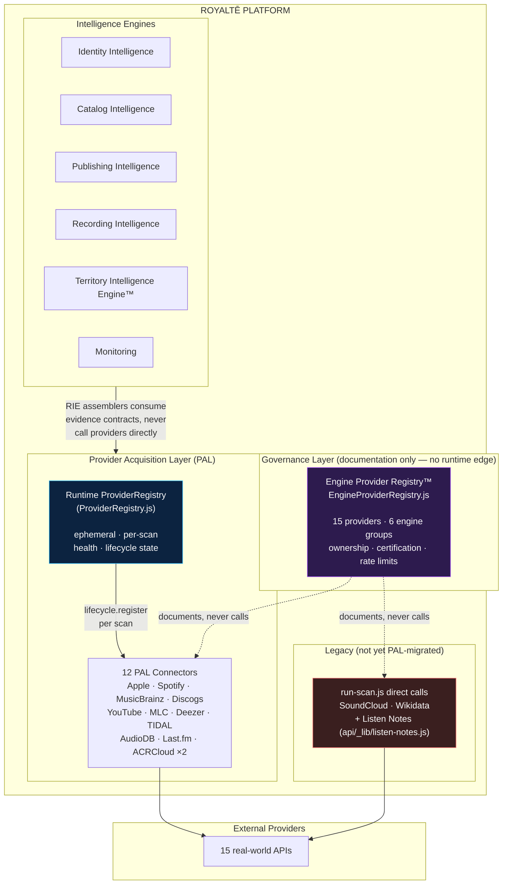

# Engine Provider Registry™ — Architecture Documentation

**ROYALTĒ v3.0 §1 — Board Implementation Brief**
**Status:** Implementation complete. Standing by for Board architecture approval.

This document is the architecture reference the Board Implementation Brief requires: how the Engine Provider Registry™ relates to the Royaltē platform, the Provider Acquisition Layer (PAL), the runtime `ProviderRegistry`, the Intelligence Engines, and the 15 external providers currently integrated.

---

## 1. The core distinction

Two things are both informally called "the provider registry" in this codebase. They are not the same component, do not import each other, and never will:

| | `ProviderRegistry.js` (runtime) | `EngineProviderRegistry.js` (governance) |
|---|---|---|
| **What it is** | A `Map`-backed class | A static, frozen, declarative data module |
| **Lifecycle** | One fresh instance per scan (`new ProviderRegistry()` inside every `ProviderAcquisitionLayer`); discarded when the scan ends | Persistent, version-controlled, unaffected by any individual scan |
| **Populated by** | `lifecycle.register()` at connector activation time | Hand-maintained source of truth, updated in the same PR that adds/changes a provider (Board Rule) |
| **Fields per entry** | 7 — `name, version, capabilityProfile, trustValue, healthState, enabled, implementationStatus` | 15 — see §3 |
| **Audience** | Code only — never read by a human directly | The Board, developers, and future integration work |
| **Location** | `provider-acquisition/registry/ProviderRegistry.js` + `RegistryEntry.js` | `provider-acquisition/registry/EngineProviderRegistry.js` |
| **Touched by this brief?** | **No — confirmed untouched, see §5** | Yes — newly created |

They complement each other: the runtime registry answers "what connector did THIS scan activate, and is it healthy right now?"; the governance registry answers "what providers does Royaltē integrate with at all, who owns each one, and has the Board certified it?"

---

## 2. Architecture diagram



**Reading the diagram:** the only *live* path from an Intelligence Engine to an external provider is `Engine → RIE assembler → PAL → Connector → Provider`. The Engine Provider Registry has no arrow into that path — it observes and documents it (dashed lines), it does not participate in it. The Legacy box (red) is a genuine, currently-live exception to the PAL architecture, surfaced by this registry rather than hidden by it (see §4).

---

## 3. Registry schema (15 fields per entry)

| Field | Purpose |
|---|---|
| `id` | Stable identifier, primary key |
| `name` | Human-readable provider name |
| `engineGroups[]` | Every Intelligence Engine that consumes this provider's evidence (Board Rule: every provider must identify every consuming engine) |
| `purpose` | Why Royaltē integrates with this provider |
| `capabilityProfile[]` | Which `Capability` enum values (from `provider-acquisition/capability/capabilityVocabulary.js`) this provider supplies |
| `dataTypes[]` | Human-readable description of the evidence supplied |
| `authMethod` | How the connector authenticates |
| `envVars[]` | Environment variables the credential set requires |
| `endpoints[]` | Base API URL(s) |
| `rateLimits` | Documented or observed rate constraints |
| `runtimeReference` | File path to the actual connector implementation (Board Rule: every provider must reference its runtime implementation) |
| `owner` | Accountable team |
| `status` | `Active` \| `Planned` \| `Deprecated` |
| `healthStatus` | `Healthy` \| `Degraded` \| `Down` \| `Unknown` |
| `certification` | `{ status, evidence }` — Board certification status plus a citation (PR #, commit, certification suite/assertion count) |
| `lastValidationDate` | ISO date of last confirmed-accurate verification |
| `notes` | Freeform — used here to record architectural findings surfaced by building this registry (see §4) |

---

## 4. Findings surfaced while building the registry

Building a genuine inventory (not a reconstruction from memory) surfaced three providers with no PAL connector at all, still called directly from `api/_lib/run-scan.js` or `api/_lib/listen-notes.js`:

- **SoundCloud** — follower-count enrichment. Its `client_id` is a literal hardcoded in `run-scan.js:1429`, not an environment variable. This is exactly the "hardcoded provider reference outside the registry" the Board's own rule exists to prevent — this registry did not introduce the condition, it surfaced a pre-existing one.
- **Wikidata** — musician-verification enrichment. No embedded credential, but still a hardcoded, unregistered call site.
- **Listen Notes** — podcast discovery, monitoring-tier only. Has its own dedicated file and a real credential-gating discipline (`isMonitoringSubscriber()`), but was never migrated to the PAL connector pattern either.

All three are marked `status: Active`, `certification.status: Not Applicable` (not `Uncertified` — there is no PAL certification suite for a non-PAL integration to fail), and flagged in their `notes` field as PAL-migration candidates. This is a factual finding, not a recommendation to act on it in this brief — no migration was performed; §6 records that explicitly.

---

## 5. Runtime registry preservation — verified

Per the Board's Final Board Validation requirement:

```
$ git diff --stat -- provider-acquisition/registry/ProviderRegistry.js provider-acquisition/registry/RegistryEntry.js
(no output — zero diff)

$ git status --short provider-acquisition/registry/
?? provider-acquisition/registry/EngineProviderRegistry.js
```

`ProviderRegistry.js` and `RegistryEntry.js` do not appear in `git status` at all — confirming byte-for-byte untouched. Only the new `EngineProviderRegistry.js` is present. This is additionally certified programmatically (not just checked once by hand) in `tests/engine-provider-registry-test.mjs`'s "Runtime ProviderRegistry.js / RegistryEntry.js remain untouched" test group, which fingerprints both files' exported shape on every run — so a future PR that accidentally touches either file fails certification, not just this one-time manual check.

---

## 6. Explicitly out of scope for this brief

- Migrating SoundCloud, Wikidata, or Listen Notes to PAL connectors (§4 findings — documented, not acted on)
- Any change to `ProviderRegistry.js` / `RegistryEntry.js`
- Enforcing "no engine may consume an unregistered provider" as a runtime gate (the Board Rule is a governance/PR-review discipline in this brief, not a code-level assertion — no such gate was built)
