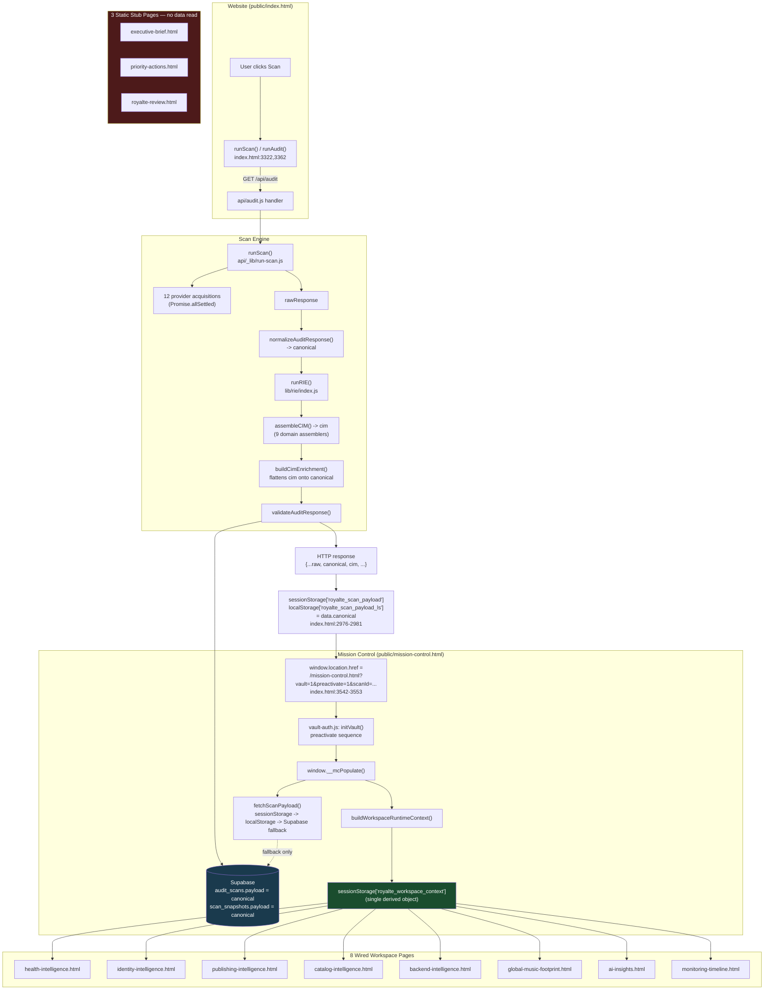

# Mission Control Handoff & Canonical Payload Discovery Report

**Status:** EVIDENCE ONLY. Per Board directive, this document contains no redesign proposals, no recommendations, and no Mission Control V2 architecture opinions. Every claim below is backed by a direct file:line citation, confirmed by two independent read-only research passes against the live repository. Sections and section numbers mirror the Board's required-deliverables list exactly (1–9). Anything not independently verified is stated as such, not assumed.

**Core question this report answers:** *What is the exact object, file, function, and execution path that transfers a completed scan from the Website into Mission Control?*

---

## 1. Complete Execution Trace

| # | Step | File:Line |
|---|---|---|
| 1 | User clicks "Run My Scan" → `runScan()` | `public/index.html:3322` |
| 2 | `runScan()` calls `runAudit()` | `public/index.html:3362` |
| 3 | `runAudit()` fires `GET /api/audit?url=...&scanId=...` | `public/index.html:2598` |
| 4 | `api/audit.js` handler: rate-limit/block checks, then `runScan(url)` | `api/audit.js:203, 224-240, 248` |
| 5 | `runScan()` — resolves canonical artist, fans out to 12 PAL/provider acquisitions via `Promise.allSettled` (10 PAL wrappers + inline `getSoundCloud()`/`getWikidata()`), builds `rawResponse` | `api/_lib/run-scan.js:86, 223, 250-251, 383, 447` |
| 6 | `api/audit.js` calls `persistCanonicalScan(result.rawResponse, ...)` | `api/audit.js:121 (def), 409 (call)` |
| 7 | `normalizeAuditResponse({...rawResponse, scanId, _originalUrl})` builds `canonical` | `api/lib/normalizeAuditResponse.js:21`, called at `api/audit.js:128` |
| 8 | `osEnrichmentFn(canonical)` → `runRIE({canonicalForEnrichment, evidencePackages, publishingWorks, ...})` | `api/audit.js:141 (call), 327 (def)`; `lib/rie/index.js:308` |
| 9 | `runRIE()`: `assembleCio()` → `runIntelligenceEngine(cio, ALL_RULES)` → 9 domain assemblers (identity, publishing, catalog, territory, globalFootprint, backend, royalteAI, health, recording) → `assembleCIM()` builds 12-object `cim` → `certifyCIM()` deep-freezes it | `api/_lib/cio-assembler.js:118`; `lib/rie/index.js:100`; `lib/rie/certify.js:33` |
| 10 | `buildCimEnrichment(cim, canonicalForEnrichment)` maps `cim` fields back onto `canonical` (adds `.cim`, `.identityIntelligence`, `.health`, etc.) | `lib/rie/CimAdapter.js:61` |
| 11 | `validateAuditResponse(canonical)` — schema gate; fatal in dev/test/CI, warn+log (`schema_violations` table) in prod/preview | `api/audit.js:157`; schema at `api/schema/auditResponse.js:324, 337-340`; env branch at `api/audit.js:91-93` |
| 12 | Persist: `supabase.from('audit_scans').insert(insertRow)` where `insertRow.payload = canonical` | `api/audit.js:175, 188` |
| 13 | (Authenticated scans only) `persistOSScanSnapshot({canonical,...})` → `supabase.from('scan_snapshots').insert(insertRow)`, `insertRow.payload = canonical` (same object), `insertRow.canonical_data = buildCanonicalDataV2(canonical)` (separately derived) | `api/_lib/persist-os-scan.js:274, 266` |
| 14 | (Authenticated scans only) `canonical.monitoringIntelligence`/`.healthIntelligence` mutated in place, written back via `supabase.from('audit_scans').update({payload: canonical}).eq('id', scanId)` | `api/audit.js:484-487` |
| 15 | HTTP response to browser: `{...rawResponse-fields-at-root, scanId, canonical, cim, identityIntelligence, publishingIntelligence}` | `api/audit.js:526-533` |
| 16 | Browser: `showRealResults(auditData)` sets `window.__royalteScan`, and separately bridges `data.canonical` (not the whole envelope) to `sessionStorage['royalte_scan_payload']` and `localStorage['royalte_scan_payload_ls']` | `public/index.html:2931, 2950, 2976-2981` |
| 17 | User clicks "CLAIM & ENTER ROYALTĒ OS" → hard navigation `window.location.href = '/mission-control.html?vault=1&preactivate=1&scanId=...&session_id=...'` | `public/index.html:3542-3553` |
| 18 | `mission-control.html` loads scripts in order: `runtime-context-mapper.js` (sync) → `mission-control.js` (module) → `vault-auth.js` (module) → `rds-preview-console.js` (deferred) | `public/mission-control.html:371-374` |
| 19 | `vault-auth.js` `initVault()` runs on `DOMContentLoaded`; with `?preactivate=1`, calls `_showPreactivateSequence()` → at `ACTIVATE_AT` calls `window.__mcPopulate()` → `window.__mcRevealHero()` → loops `MODULE_ORDER` calling `window.__mcRevealModule(id)` for 9 ids → raises auth *after* data is already showing | `vault-auth.js:33, 50-65, 268-382` |
| 20 | `__mcPopulate()` calls `fetchScanPayload()`: sessionStorage (consume-on-read) → localStorage (4h TTL) → Supabase `audit_scans.select('payload').eq('id', scanId)` fallback; then calls `buildWorkspaceRuntimeContext()` and writes the single result to `sessionStorage['royalte_workspace_context']` | `mission-control.js:73-189, 1353-1354, 1471-1484` |
| 21 | User navigates to an individual workspace page (`public/workspaces/*.html`); workspace reads `window.RoyalteContext.readWorkspaceContext({contract: '<name>'})`, which reads `sessionStorage['royalte_workspace_context']` | `public/js/mc-workspace-context.js:277-312`; e.g. `public/workspaces/health-intelligence.html:566` |

**Note on `mission-control.html` itself:** `initMissionControl()` (`mission-control.js:1234-1242`) checks for `?vault=1`; on the production vault path it returns immediately without calling `fetchScanPayload()` directly — that call only happens inside `__mcPopulate()`, invoked by `vault-auth.js`'s preactivate or post-auth flow (step 19 above), not by `mission-control.js`'s own bootstrap.

---

## 2. Does a True Canonical Scan Payload Exist?

**Multiple named objects exist across the pipeline. They are not all the same shape, but one of them — `canonical` — is a genuine single object that persists unchanged from creation through to Mission Control.**

| Object | Created at | Complete or partial | Persisted or memory-only |
|---|---|---|---|
| `rawResponse` | `api/_lib/run-scan.js:383`, inside `runScan()` | Raw legacy engine shape (flat fields: `artistName`, `followers`, `platforms.*`, etc.) | In-memory only; never persisted directly, but spread into the final HTTP response root |
| **`canonical`** (a.k.a. `AuditResponse`, schema v1.2.0) | `normalizeAuditResponse()`, `api/lib/normalizeAuditResponse.js:21` | Complete — this is the object subsequently enriched in place with `.cim`, `.identityIntelligence`, `.health`, etc. | **Persisted.** Same object written to `audit_scans.payload` (`api/audit.js:175,188`), `scan_snapshots.payload` (`persist-os-scan.js:274`), bridged via `sessionStorage`/`localStorage` as `data.canonical` (`index.html:2976-2981`), and read back by Mission Control (`row.payload`, `mission-control.js:163-184`) |
| `cim` (12-object Canonical Intelligence Model) | `assembleCIM()`/`certifyCIM()`, `lib/rie/index.js:100`, `lib/rie/certify.js:33` | Complete on its own terms, deep-frozen | Nested inside `canonical.cim`, not persisted as an independent row |
| `canonical_data` (`buildCanonicalDataV2`) | `api/_lib/persist-os-scan.js:266` | A re-derived shape (adds delta-engine diff-list arrays) | Persisted separately to `scan_snapshots.canonical_data` — distinct from `canonical` in the same row's `payload` column |
| HTTP response body | `api/audit.js:526-533` | Superset/wrapper: legacy flat fields at root + `canonical` nested + `cim`/intelligence aliases at root | Wire format only, not itself persisted |
| `royalte_workspace_context` | `buildWorkspaceRuntimeContext()`, invoked at `mission-control.js:1481` | A transformed/reshaped derivative of `canonical`, built once at Mission Control activation | `sessionStorage`, 4-hour TTL (`mc-workspace-context.js:43, 252-260`) |

**Direct answer: YES, in the sense that matters for this investigation — a single, well-defined canonical object (`canonical`) exists, and it is literally the same object/reference that reaches `audit_scans.payload`, `scan_snapshots.payload`, the storage bridge, and what Mission Control reads back.** However:
- The HTTP wire response is a different, wider shape than `canonical` alone — the frontend explicitly extracts `data.canonical` before bridging to Mission Control (comment documenting this deliberately at `public/index.html:2962-2968`).
- Mission Control does not read `canonical` (or `cim`) directly — it reads a further derivative, `royalte_workspace_context`, built once by `buildWorkspaceRuntimeContext()` at activation time (§4).
- `cim` — described in code comments as the intended long-term source of truth ("Phase 3.2 consumers: read from response.cim directly") — is *not* what workspace pages actually consume; `CimAdapter.buildCimEnrichment` still flattens `cim.*` back onto `canonical.*` for backward-compatibility, and it is those flattened fields that flow onward.
- `normalizeAuditResponse.js` and `validateAuditResponse` (the documented canonical schema machinery per CLAUDE.md) are confirmed live in the call path (`api/audit.js:128, 157`) — not dead/legacy code. Schema conformance is hard-enforced only in dev/test/CI; in production it is logged to a `schema_violations` table but does not block persistence.

---

## 3. Exact Website → Mission Control Handoff

Two mechanisms operate together, confirmed by direct code read:

**A. Data bridge (written at scan-completion time, before any navigation):**
```js
// public/index.html:2976-2981
sessionStorage.setItem('royalte_scan_payload', JSON.stringify(data.canonical));
localStorage.setItem('royalte_scan_payload_ls', JSON.stringify({ payload: data.canonical, storedAt: Date.now() }));
```

**B. Navigation (fired on button click, not automatic):**
```js
// public/index.html:3542-3553
openMcBtn.addEventListener('click', function() {
  const scanId    = window.__royalteScan?.scanId || '';
  const sessionId = (typeof getOrCreateSessionId === 'function') ? getOrCreateSessionId() : '';
  let dest = '/mission-control.html?vault=1&preactivate=1';
  if (scanId)    dest += '&scanId='     + encodeURIComponent(scanId);
  if (sessionId) dest += '&session_id=' + encodeURIComponent(sessionId);
  window.location.href = dest;
});
```

This is a **hard page navigation** (`window.location.href`), not an SPA route change — Mission Control is a separate page load, not a client-side transition. `scanId` also rides as a URL query parameter, which gives `fetchScanPayload()` a third, independent recovery path (direct Supabase query) if both storage bridges are empty or stale.

---

## 4. Mission Control Bootstrap — Documented Sequence

See Execution Trace §1, steps 18–20, for the full ordered sequence with citations. Key findings specific to this section:

- **`window.__mcBoot` is referenced in `vault-auth.js` (lines 93, 333, 625, 633) but is never defined anywhere in the repository** (confirmed by repository-wide search). On the normal (non-preactivate) authenticated-vault path, `_triggerBoot()` calls `window.__mcBoot?.runActivationSequence()` — since `__mcBoot` does not exist, this call is a no-op, and the `MutationObserver` that would call `__mcRevealModule()` on `mc-online` class changes never fires because nothing ever adds that class.
- **`public/mission-control.html` contains zero `data-mc-*` attributes and none of the module-id elements** (`ecosystem-status`, `health-intelligence`, etc.) that the reveal/populate machinery targets — confirmed via `grep -c "data-mc-" public/mission-control.html` = 0 and a repository-wide search for the expected class/id names returning no matches in that file.
- **The one concrete, load-bearing side effect of `__mcPopulate()` on the current page is writing `sessionStorage['royalte_workspace_context']`** — this is what actually reaches the workspace pages; the DOM-reveal/module-population machinery in `mission-control.js`/`vault-auth.js` operates on elements that are not present on `mission-control.html` as currently built.
- Mission Control never calls `api/mission-control-api/` or `api/mission-control-integration/` (repository-wide search, zero references). It reads `audit_scans.payload` directly via the Supabase client. The only other API call in this entire flow is `POST /api/claim-scan` (`vault-auth.js:587`).

---

## 5. Data Ownership Map

Ownership below is drawn directly from the 9-domain-assembler call list confirmed in `lib/rie/index.js` (Execution Trace §1, step 9) and the per-workspace consumer citations in §6. Where a mapping between a listed dataset and its owning engine file was inferred from naming/call-site rather than independently field-verified, it is marked **(inferred, not field-verified)**.

| Dataset | Owner (Source File) | Builder Function | Consumers |
|---|---|---|---|
| Artist (subject identity) | `api/_lib/cio-assembler.js` | `assembleCio()` | All 9 domain assemblers (input), `canonical` root fields |
| Tracks / recordings | `lib/recording/recording-intelligence.js` **(inferred, not field-verified)** | recording domain assembler, called from `lib/rie/index.js:100` list | `cim`, flattened onto `canonical` |
| Identity | `api/_lib/identity-intelligence.js` | identity domain assembler | `identity-intelligence.html` via `RoyalteContext.readWorkspaceContext({contract:'identity-intelligence'})` (`:555`) |
| Publishing | `api/_lib/publishing-intelligence.js` | publishing domain assembler | `publishing-intelligence.html` (`:1002`) |
| Catalog | `api/_lib/catalog-intelligence.js` | catalog domain assembler | `catalog-intelligence.html` (`:991`) |
| Health | `api/_lib/health-engine.js` + `api/_lib/health-intelligence.js` (per §9 "One Health Engine" directive) | health domain assembler | `health-intelligence.html` (`:566`) — **with one documented exception**: `health-timeline.js` renders a hardcoded 7-scan fixture (`var SCANS=[...]`, `js/health-timeline.js:17`) independent of live context data |
| Timeline (Monitoring) | Owner not independently confirmed in this pass — presumed `api/_lib/monitoring-intelligence.js` per call-list, **not field-verified** | — | `monitoring-timeline.html` (`:167`), reads shared context + `RoyalteIntel` (`:154`) |
| Global Music Footprint | `api/_lib/global-music-footprint.js` + `api/_lib/territory-intelligence.js` | globalFootprint domain assembler | `global-music-footprint.html` (`:588`) and `gmf-distribution-gaps.js` (independent second read of the same context key, `:18-19` — not a separate data source) |
| AI | `api/_lib/royalte-ai-assembler.js` | royalteAI domain assembler | `ai-insights.html` (`:603`), via `RoyalteIntel` (`:562`) |
| Executive Review | `api/_lib/executive-brief-engine.js` (engine-side, confirmed live in RIE pipeline per Execution Trace §1 step 9) | executive brief assembler | **No confirmed frontend consumer** — `executive-brief.html` is a static "Coming Soon" stub containing no data-reading scripts beyond `rds-preview-console.js` (§6). Engine output is generated but not rendered by any workspace page found in this investigation. |

---

## 6. Workspace Dependency Audit

All 11 files under `public/workspaces/`, evidence-backed. **Zero of the 11 files contain a `fetch(` call or reference `supabase` directly** (confirmed by grep across all 11 files).

| Workspace file | Reads shared object? | Own lookups? | Reads runtime context? | Reads registry? | Multiple sources? |
|---|---|---|---|---|---|
| `health-intelligence.html` | Yes — contract `health-intelligence` (`:566`) | No | Yes (`mc-workspace-context.js` include, `:46`) | Yes — `RoyalteIntel` (`:551`) | **Yes** — `health-timeline.js` renders a hardcoded fixture independent of live context |
| `identity-intelligence.html` | Yes — contract `identity-intelligence` (`:555`) | No | Yes (`:118`); **second independent read** at `:750` (no contract, for artwork) | No | Two separate read call-sites into the same sessionStorage key |
| `publishing-intelligence.html` | Yes — contract `publishing-intelligence` (`:1002`) | No | Yes (`:470`) | No | No |
| `catalog-intelligence.html` | Yes — contract `catalog-intelligence` (`:991`) | No | Yes (`:86`) | No | No |
| `backend-intelligence.html` | Yes — contract `backend-intelligence` (`:712`) | No | Yes (`:192`) | No | No |
| `global-music-footprint.html` | Yes — contract `global-music-footprint` (`:588`) | No | Yes (`:98`) | No | **Yes** — `gmf-distribution-gaps.js` performs its own separate `readWorkspaceContext()` call (`:18-19`); `global-map-viewport.js` is fed via `options` param, not context |
| `ai-insights.html` | Yes — contract `ai-insights` (`:603`) | No | Yes (`:148`) | Yes — `RoyalteIntel` (`:562`) | No |
| `monitoring-timeline.html` | Yes — contract `monitoring-timeline` (`:167`) | No | Yes (`:10`) | Yes — `RoyalteIntel` (`:154`) | No |
| `executive-brief.html` | No | No | No — static stub | No | No |
| `priority-actions.html` | No | No | No — static stub | No | No |
| `royalte-review.html` | No | No | No — static stub | No | No |

8 of 11 workspaces read exclusively from the single shared `sessionStorage['royalte_workspace_context']` object (via `window.RoyalteContext.readWorkspaceContext()`, `mc-workspace-context.js:277-312`). 3 of 11 are static content stubs with no data-reading code at all. `mc-intelligence-utils.js` (backing `RoyalteIntel`) has its own `readContext()` (`:97-103`) that independently re-reads the *same* `royalte_workspace_context` key — redundant access path, not a second data source.

---

## 7. Runtime Object Inventory

| Object | Creator | Consumers | Lifetime |
|---|---|---|---|
| `sessionStorage['royalte_scan_payload']` | Written by the pre-MC scan flow (write site not located in this pass — see §9 "not fully verified") | `fetchScanPayload()`, consumed and deleted on read (`mission-control.js:108-110`) | Single-use, per-scan |
| `localStorage['royalte_scan_payload_ls']` | `public/index.html:2976-2981` (`showRealResults`) | `fetchScanPayload()` fallback (`mission-control.js:122`) | 4-hour TTL |
| `localStorage['royalte_pending_scan_id']` | `vault-auth.js:512` (new-signup email-confirm path) | `vault-auth.js:45, 726-728` (`_pendingScanId()`) | Until consumed post-signup |
| `sessionStorage['royalte_session_context']` | `mission-control.js:1415-1419` (artist/album artwork + `bestVerifiedRelease`) | **No consumer found anywhere in the repository** — write-only, dead key as of this snapshot | N/A |
| `sessionStorage['royalte_workspace_context']` | `buildWorkspaceRuntimeContext()`, written once inside `__mcPopulate()` (`mission-control.js:1481`) | All 8 wired workspace pages (§6) + `gmf-distribution-gaps.js`, via `window.RoyalteContext.readWorkspaceContext()` | Per-scan/session, 4-hour TTL (`mc-workspace-context.js:43, 252-260`) |
| `localStorage['royalte_session_id']` | `getOrCreateSessionId()`, `supabase-client.js:42-56` | Exposed as `window.getOrCreateSessionId`; used in scan requests and MC navigation | Persistent per-browser |
| `localStorage['royalte_reporting_tz']` | `royalte-tz.js:22, 58` | `royalte-tz.js:66`; independent of scan payload | Persistent per-browser |
| `window.buildWorkspaceRuntimeContext` | `runtime-context-mapper.js:163` | `mission-control.js:1472` (sole consumer) | Page-load scoped |
| `window.__mcPopulate` / `__mcRevealModule` / `__mcRevealHero` | `mission-control.js:1353, 1487, 1621` | `vault-auth.js` (multiple call sites, §1/§4) | Page-load closure (`_vaultPlans`, module-scope, never persisted) |
| `window.__mcBoot` | **Never defined anywhere in the repository** (confirmed by search) | Read (but effectively no-op) in `vault-auth.js:93, 333, 625, 633` | N/A — dead reference |
| `window.__royaltePreactivated` | `vault-auth.js:366` | `vault-auth.js:537` | Page-load scoped |
| `window.RoyalteContext` | `mc-workspace-context.js:326` (IIFE) | Every wired workspace page + `gmf-distribution-gaps.js` | Page-load scoped, per workspace page |
| `window.RoyalteIntel` | `mc-intelligence-utils.js:105` | `ai-insights.html`, `health-intelligence.html`, `monitoring-timeline.html` | Page-load scoped |
| `window.getSupabase` / `window.getOrCreateSessionId` | `supabase-client.js:63-65` | `mission-control.js`, `vault-auth.js`, `dashboard.js` | Singleton, page-load scoped |
| Supabase auth-session storage | Managed internally by the vendored `supabase-js` client (`persistSession:true`, `supabase-client.js:24-30`) | Not enumerated key-by-key in this pass | Not verified |

---

## 8. Architectural Dependency Graph



---

## 9. Direct Answers

**Does a true Canonical Scan Payload exist? YES.**
The `canonical` object (`normalizeAuditResponse()`, `api/lib/normalizeAuditResponse.js:21`, AuditResponse schema v1.2.0), enriched in place with CIM-sourced fields, is the same object persisted to `audit_scans.payload` and `scan_snapshots.payload`, bridged via storage, and read back by Mission Control. See §2 for full detail and the one caveat (the HTTP wire response is a wider wrapper, not `canonical` alone).

**Does Mission Control consume ONE source of truth? YES, for 8 of 11 workspaces — with two documented exceptions.**
All 8 wired workspaces read exclusively from `sessionStorage['royalte_workspace_context']`, itself derived once from `canonical` by `buildWorkspaceRuntimeContext()` at activation. Exceptions: `health-timeline.js` renders a hardcoded fixture independent of that context (§6); 3 of 11 workspace pages (`executive-brief.html`, `priority-actions.html`, `royalte-review.html`) are static stubs that read no data source at all, shared or otherwise.

**Does Mission Control rebuild state? YES, once, centrally.**
`buildWorkspaceRuntimeContext()` (`runtime-context-mapper.js`) transforms the canonical payload into `royalte_workspace_context` before any workspace reads it — this is a genuine reshape, not a zero-transformation passthrough. It happens exactly once per activation, not independently per workspace (`identity-intelligence.html`'s second read and `mc-intelligence-utils.js`'s own `readContext()` re-read the same already-built object, they do not rebuild it).

**Does Mission Control perform additional provider lookups? NO.**
Zero `fetch(` calls and zero direct `supabase` references were found in any of the 11 workspace HTML files. `mission-control.js` itself queries Supabase only for the already-persisted `audit_scans.payload` — it does not re-acquire data from Apple/Spotify/etc. providers.

**Is the Website solely responsible for the scan? YES.**
All provider acquisition (12 PAL connectors + inline SoundCloud/Wikidata) occurs exclusively inside `api/_lib/run-scan.js`, reachable only from `api/audit.js`, reachable only from the Website's scan flow (`public/index.html`). No code path was found where Mission Control or any workspace triggers new provider acquisition.

**Is Mission Control functioning as a second application?**
Evidence-based observations, not a redesign opinion: Mission Control is structurally a separate multi-page application — its own landing page with its own auth/session bootstrap (`vault-auth.js`), its own runtime-context-derivation layer (`runtime-context-mapper.js`), and a partially redundant "intelligence utils" layer (`mc-intelligence-utils.js`) that duplicates context-reading logic already present in `mc-workspace-context.js`. It does not perform its own scans or provider lookups (confirmed above), and for 8 of 11 workspaces it is a pure consumer of the Website's canonical payload via one derived shared object. The `window.__mcBoot` reference with no definition anywhere in the repository (§4) means part of its own documented activation sequence — `runActivationSequence()` — currently does not execute on the non-preactivate path.

---

## Not Fully Verified (stated explicitly, not assumed)

- The original write site of `sessionStorage['royalte_scan_payload']` was not independently located beyond its consumer in `fetchScanPayload()`.
- `getOrCreateSessionId()` internals and the anonymous-session→authenticated-user scan-claim flow (`migrate_anonymous_scans`) were not traced.
- The internal field mappings of the 9 domain assemblers (`identity-intelligence.js`, `publishing-intelligence.js`, `catalog-intelligence.js`, `territory-intelligence.js`, `global-music-footprint.js`, `backend-intelligence.js`, `royalte-ai-assembler.js`, `health-engine.js`/`health-intelligence.js`, `recording-intelligence.js`) were confirmed only at the call-site/signature level, not read line-by-line — the Data Ownership Map (§5) reflects this granularity and flags one entry as inferred.
- `public/js/mission-control-renderers.js` internals (how it distinguishes `payload.cim` vs. flattened fields) were sampled via import list and header comment, not fully read.
- `public/js/dashboard.js` was sampled via grep only, not confirmed to share `fetchScanPayload()`'s exact logic.
- No runtime/browser execution was performed — all findings are static code reads, per the read-only mandate.
