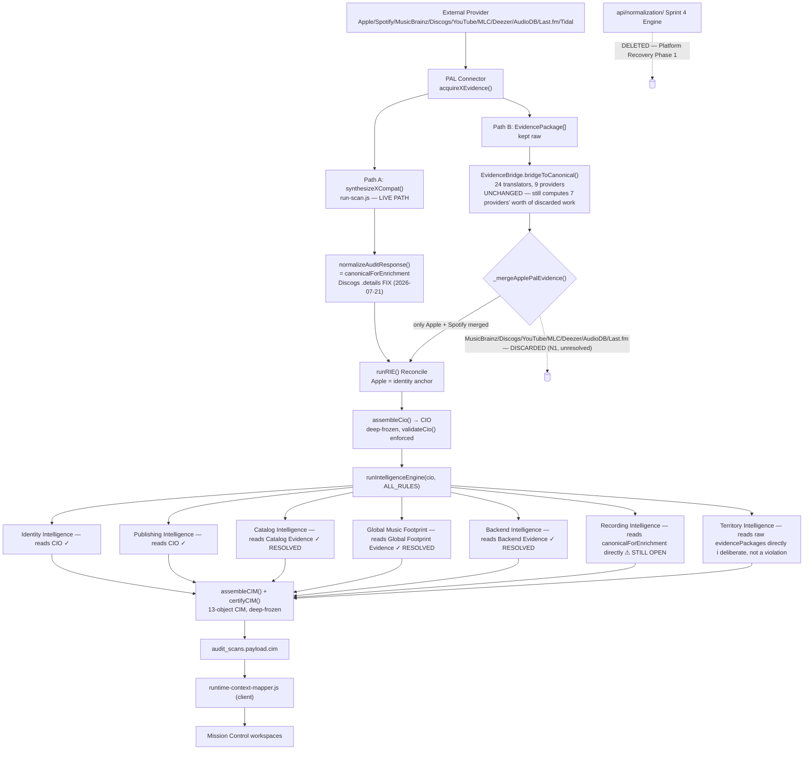

# ROYALTĒ v3.0 — NORMALIZATION LAYER COMPLETION

**Type:** Architecture Discovery → Targeted Remediation
**Status:** Complete
**Branch:** `recovery/normalization-layer-completion`
**Prerequisite:** Platform Recovery Phase 1 (Foundation Recovery), PR #384, PR #385 — all merged
**Baseline certification:** `governance/NORMALIZATION_LAYER_PLATFORM_CERTIFICATION.md` (🟡 Certified with Conditions, commit `f71f497`)
**Date:** 2026-07-21

---

## 1. Executive Normalization Report

### 1.1 What this project verified

This is a **re-certification**, not a fresh audit — the Normalization Layer was already comprehensively mapped by the baseline certification cited above. That report found 6 ranked findings (N1-N6) and rated the layer 🟡. Since that report was written (commit `f71f497`), three separate recovery efforts have landed on `main`: **Platform Recovery Phase 1** (Foundation Recovery), the **Phase 2 Workspace Recovery Program** (Identity/Publishing/Catalog/Health/Backend/Global-Music-Footprint), and the **Canonical Scan Subject™ / Scan Entry Point Audit™ / Identity Resolution Completion** chain (PRs #384, #385). This project's job was to determine, with fresh evidence, how much of the original 🟡 rating those efforts already closed, find anything newly broken or newly discovered, and correct only what's verified — per this assignment's explicit non-goals, not to redesign anything.

### 1.2 Findings disposition — what changed since the baseline

| Finding | Baseline (🟡 cert) | Current status | Evidence |
|---|---|---|---|
| **N1** — duplicate normalization computed + discarded every scan (EvidenceBridge, 7 of 9 providers) | 🔴 High | **Unchanged, still active.** Board-decision-gated (ADR-004, recommends Option B "park, document" — zero engineering cost, no removal). Not this project's call to unilaterally resolve. | `lib/rie/EvidenceBridge.js` still 1,146 lines / 24 translator functions; `_mergeApplePalEvidence()` (`lib/rie/index.js:263-300`) still merges only Apple + Spotify branches — byte-identical to baseline, confirmed by direct re-read. |
| **N2** — core logic lives in code marked temporary, no replacement built | 🔴 High | **Unchanged.** Same ADR-004 gate as N1 — they are the same underlying decision. | `EvidenceBridge.js:15-34` header unchanged. |
| **N3** — dormant, zero-caller Sprint 4 Normalization Engine (`api/normalization/`) | 🟡 Medium | ✅ **RESOLVED.** Deleted in Platform Recovery Phase 1 (1,413 lines + test file). | `ls api/normalization/` → does not exist. Confirmed by `git log --oneline --all \| grep -i foundation` → `62738e1 Platform Recovery Phase 1 — Foundation Recovery`. |
| **N4** — 4 domain assemblers bypass the CIO | 🟡-🔴 Medium-High | ✅ **3 of 4 RESOLVED** (Catalog, Backend, Global Music Footprint — Board "Option 3" sibling-evidence-object pattern). ⚠ **1 of 4 still open** (Recording Intelligence — added later, Phase 3.7, never in scope for the 2026-07-20 recovery target list). | `lib/rie/index.js:61-86` — three "RESOLVED" comment blocks citing PRs, one remaining "Known Phase 3 violation" comment for Recording Intelligence. `governance/adr/ADR-002-CIO-Scope.md` updated in this project to match (was stale — still read "Decision Pending" after the resolution had already merged). |
| **N5** — CIO confidence constants hardcoded `'UNKNOWN'` | 🟡 Low-Medium | **Unchanged.** Correctly out of scope — implementing real confidence scoring is a feature addition (business logic), not a normalization defect; this assignment's own Constitutional Guidance says normalization "does NOT... infer business conclusions." | `api/schema/cio.js:196-200` — all 5 constants still literal `'UNKNOWN'`. |
| **N6** — `governance/ROADMAP.md` understated PAL migration progress | 🟢 Low | ✅ **RESOLVED**, via a separate initiative (Engine Provider Registry™) not tracked as N6's fix at the time. | `governance/ROADMAP.md:18` now correctly states "12 PAL-migrated and Board-certified, 3 legacy/not-yet-migrated" (SoundCloud, Wikidata, Listen Notes — confirmed against live `run-scan.js`, which calls `getSoundCloud`/`getWikidata` directly, not via PAL). |

**Net: 3 of 6 original findings fully resolved, 1 of 6 (N4) three-quarters resolved with the remaining quarter clearly scoped, 2 of 6 (N1/N2) genuinely unchanged and correctly still gated behind a pending Board architectural decision (ADR-004) that this narrowly-scoped project has no mandate to make unilaterally.**

### 1.3 New finding from this project's own verification pass

Re-walking every provider's normalization path from scratch (not just re-confirming the baseline's claims) surfaced one genuinely new, verified defect, previously uncaught:

**Discogs' total-release count was silently discarded on every scan.** `discogs-pal-acquisition.js`'s `synthesizeDiscogsCompat()` correctly fetches and computes a real release count from Discogs' API (`totalReleases` from `Capability.RELEASES` pagination), which reaches `rawResponse.discogsReleases` (a number) in `run-scan.js`. But `normalizeAuditResponse.js`'s `_normalizePlatforms()` mapped Discogs through the boolean-only `simple()` helper — `details: null`, unconditionally, for every scan, regardless of whether real release-count data existed. Its actual consumer, `catalog-intelligence.js:238-240`'s `physicalReleaseCount` field, was therefore **permanently `null`** in every certified CIM ever produced — confirmed in `public/fixtures/canonical-black-alternative.json`, where it appears twice, both `null`.

This is exactly the class of issue this assignment's Primary Objectives named explicitly: *"No provider evidence is silently discarded."* It was violated, for one field, for every scan, since Discogs PAL acquisition went live. See §5 (Targeted Remediation) for the fix.

**A related, non-defect observation surfaced by the same investigation:** `catalog-evidence.js`'s companion field, `discogsReleases` (an array of *individual, dated* release records), is — and, before and after this fix, remains — always `[]`. This is **not** a normalization bug: no code anywhere in the pipeline ever acquires per-release dated Discogs records; `discogs-pal-acquisition.js` only ever fetches a pagination *count*. `catalog-intelligence.js`'s Discogs-year-range fallback logic (lines 254-264) that depends on that array is therefore permanently unreachable — correctly so, given no data exists for it to act on. Populating it would require new Discogs provider-acquisition capability (fetching individual release records), which is acquisition-layer scope expansion, explicitly out of bounds for a normalization-layer correction. Documented in `catalog-evidence.js`'s own doc comment so a future audit doesn't re-discover this as a mystery.

### 1.4 Corrections made

One targeted fix, referencing the one new verified finding (§1.3):

- `api/lib/normalizeAuditResponse.js` — `_normalizePlatforms()`'s Discogs branch now produces `{ availability, details: { totalReleases } }`, mirroring the existing Apple/YouTube/Deezer/Tidal `.details` pattern, instead of the boolean-only `simple()` shape. Populated from `r.discogsReleases`, a value already computed upstream — no new acquisition, no new schema field (the `details.totalReleases` shape already existed conceptually via `catalog-evidence.js`'s doc comment, it just had no live data feeding it).
- `api/_lib/catalog-evidence.js` — no behavior change; doc comment updated to explain why `discogsTotalReleases` now works and why `discogsReleases` (the array) correctly remains empty (§1.3).
- `governance/adr/ADR-002-CIO-Scope.md` — corrected from stale "Decision Pending" to reflect the 3-of-4 resolution that had already merged before this project began (§1.2, N4).

### 1.5 Remaining risks (carried forward, not resolved here — by design)

- **N1/N2 (EvidenceBridge duplicate computation)** — real, currently-active, Board-decision-gated. ADR-004 remains the correct vehicle; this project did not have Board authorization to choose Option A/B/C unilaterally, and doing so would have violated this assignment's own non-goal ("No architectural redesign").
- **N4, Recording Intelligence** — one remaining CIO-bypass instance, with an already-proven fix pattern (3 precedents in this exact codebase) but explicitly not implemented here because this assignment's non-goals list "no new canonical objects," and a 4th sibling evidence object — even one following established precedent — was judged to warrant its own explicit go-ahead rather than being folded into a discovery-scoped project. Recommended correction and estimated scope recorded in ADR-002's updated Final Resolution section.
- **CIM evidence-lineage completeness** — the baseline certification flagged as **UNVERIFIED** whether production CIMs carry `scanAuthority` evidence lineage (this requires querying live `audit_scans` rows, not static code review). Still unverified; out of reach for a code-only audit.
- **N5 (CIO confidence scoring)** — correctly still unimplemented; feature work, not a normalization defect.

---

## 2. Provider Flow Matrix

`Provider → Connector → Normalization → Canonical Object → Consumers`, current as of this audit. "Path A" = the live path that reaches production. "Path B" = `EvidenceBridge.bridgeToCanonical()`, computed for every provider it has a translator for, but only merge-authoritative for Apple + Spotify (§1.2, N1).

| Provider | Connector (PAL) | Path A Normalization | Path B (EvidenceBridge) | Canonical Object Reached | Consumers |
|---|---|---|---|---|---|
| **Apple Music** | `AppleMusicConnector.js` | `synthesizeAppleMusicCompat()` → `normalizeAuditResponse.js` → rich `.details` (albums, artwork, storefront availability, ISRC lookup) | Translator exists, **merge-authoritative** (survives `_mergeApplePalEvidence`) | CIO (`identity`, `publishing` sections), Catalog/Backend/GMF sibling evidence objects, Canonical Scan Subject™ (release identity, PR #384/#385) | Identity Intelligence, Publishing Intelligence, Catalog/Backend/GMF (via evidence objects), Territory Intelligence (raw `evidencePackages`, bypasses normalization entirely — deliberate) |
| **Spotify** | `SpotifyConnector.js` | `synthesizeSpotifyCompat()` → `normalizeAuditResponse.js` → `subject`, always-VERIFIED platform flag | Translator exists, **merge-authoritative** | CIO (`identity`), Canonical Scan Subject™ (Spotify Track URL path — 🟢 fully compliant per Scan Entry Point Audit™) | Identity Intelligence, Catalog Intelligence (`fallbackCounts`, Spotify-derived) |
| **MusicBrainz** | `MusicBrainzConnector.js` | `synthesizeMBCompat()` → `normalizeAuditResponse.js` → boolean-only (`simple()`) | Translator exists, discarded | Backend Evidence (availability boolean only) | Backend Intelligence |
| **YouTube** | `YouTubeConnector.js` | `synthesizeYouTubeCompat()` → `normalizeAuditResponse.js` → rich `.details` (officialChannel, ugc, subscriberCount) | Translator exists, discarded | `canonicalForEnrichment.platforms.youtube` | Health/royalty-gap estimation, module scoring |
| **Deezer** | `DeezerConnector.js` | `synthesizeDeezerCompat()` → `normalizeAuditResponse.js` → `_normalizeDeezerPlatform()`, rich | Translator exists, discarded | `canonicalForEnrichment.platforms.deezer`, Backend Evidence | Backend Intelligence, module scoring |
| **TIDAL** | `TidalConnector.js` | `synthesizeTidalCompat()` → `normalizeAuditResponse.js` → `_normalizeTidalPlatform()`, rich | **No translator exists** — confirmed by grep, zero matches. TIDAL is the one provider with zero duplicate computation. | `canonicalForEnrichment.platforms.tidal`, Backend Evidence | Backend Intelligence, module scoring |
| **Discogs** | `DiscogsConnector.js` | `synthesizeDiscogsCompat()` → `normalizeAuditResponse.js` → **now** `{ details: { totalReleases } }` (fixed this project, §1.3-1.4; previously boolean-only) | Translator exists, discarded | Catalog Evidence (`discogsTotalReleases` — now live) | Catalog Intelligence (`physicalReleaseCount` — now populated for the first time) |
| **Last.fm** | `LastFmConnector.js` | `synthesizeLastFmCompat()` → `normalizeAuditResponse.js` → boolean-only + separate scalar fields (`lastfmPlays`, `lastfmListeners`) | Translator exists, discarded | Backend Evidence (boolean), royalty-gap estimation (scalars) | Backend Intelligence, royalty-gap engine |
| **TheAudioDB** | `AudioDbConnector.js` | `synthesizeAudioDbCompat()` → `normalizeAuditResponse.js` → boolean-only | Translator exists, discarded | Backend Evidence (boolean), country/PRO-guide derivation | Backend Intelligence, PRO Guide |
| **The MLC** | `MLCConnector.js` | **Does not go through `normalizeAuditResponse.js` at all.** `lib/publishing/mlc-adapter.js`'s `normalizeMlcWork(s)` — sole owner, board-locked — is a dedicated, separate normalizer feeding `publishingWorks` directly into the CIO assembler. | Translator exists, discarded (irrelevant — MLC's real path never touches EvidenceBridge or `normalizeAuditResponse.js`) | CIO (`publishing`) | Publishing Intelligence |
| **Territory Intelligence inputs** (Apple `Capability.AVAILABILITY`/`TERRITORIES`) | `AppleMusicConnector.js` (same connector as Apple Music row) | **None** — `assembleTerritoryIntelligence(evidencePackages)` reads raw PAL evidence directly, by deliberate Board design (Phase 5.2), explicitly documented as *not* repeating the CIO-bypass violation pattern (`lib/rie/index.js:97-102`) | N/A | Territory Intelligence Engine™ output (5-state model) | Global Music Footprint™ |

**Legacy, non-PAL, out of this audit's named provider list (confirmed still direct-call, per `governance/ROADMAP.md`'s corrected N6 entry):** SoundCloud, Wikidata — both called directly from `run-scan.js` (`getSoundCloud`, `getWikidata`), predate the PAL architecture, no connector, no certification suite. Listen Notes is PAL-migrated but gated to the monitoring subscription tier only (`api/_lib/podcast-intelligence.js`), never called from the free scan path — out of scope for this audit's provider list.

---

## 3. Canonical Ownership Matrix

| Canonical Object | Owner (assembler) | Validator | Call sites (per scan) | Consumers | Can anything overwrite it? |
|---|---|---|---|---|---|
| **Canonical Scan Subject™** | `api/_lib/canonical-scan-subject-assembler.js` — `seedCanonicalScanSubject()` (post-Identity-Resolution) then `enrichWithAppleRelease()` (post-Apple-ISRC-lookup) | `api/schema/canonical-scan-subject.js` — `validateCanonicalScanSubject()`, structural only | Seed: once, `run-scan.js:219`. Enrich: once, `apple-pal-acquisition.js:167` | `canonicalForEnrichment.canonicalScanSubject` (present, not yet consumed by any Intelligence Domain beyond Apple's own availability-album selection) | No — both functions return new deep-frozen objects, never mutate. Enrichment produces a distinct object from the seed rather than overwriting it in place. |
| **CIO** (Canonical Intelligence Object) | `api/_lib/cio-assembler.js` — `assembleCio()` | `validateCio()`, enforced in `runRIE()` since Platform Recovery Phase 1 (short-circuits to a safe empty CIM on failure, does not silently propagate) | Exactly once, `lib/rie/index.js:384` (confirmed single call site) | `runIntelligenceEngine()`, `assembleIdentityIntelligence`, `assemblePublishingIntelligence` | No — deep-frozen on assembly (`cio-assembler.js:67-76`) |
| **CIM** (Canonical Intelligence Model, 13 objects) | `assembleCIM()` (`lib/rie/index.js:100-226`) + `certifyCIM()` (`lib/rie/certify.js`) | `certifyCIM()` — throws if any §8.2 key is absent (hard contract, not conventional) | Exactly once, `lib/rie/index.js:465`, inside `runRIE()` (the sole OS entrypoint) | Persisted whole to `audit_scans.payload.cim`; Mission Control reads via `runtime-context-mapper.js` | No — `certifyCIM()` deep-freezes the entire object |
| **Catalog Evidence** | `api/_lib/catalog-evidence.js` — `assembleCatalogEvidence()` | None dedicated — pure structural relocation, no separate validation function (consistent with its sibling-evidence-object design: it never claims to be a complete/authoritative object, just a relocated view) | Exactly once, `lib/rie/index.js:458` | Catalog Intelligence only | No — deep-frozen; never throws (retrofitted try/catch, confirmed in code) |
| **Backend Evidence** | `api/_lib/backend-evidence.js` — `assembleBackendEvidence()` | None dedicated (same rationale as Catalog Evidence) | Exactly once, `lib/rie/index.js:484` | Backend Intelligence only | No — deep-frozen, never throws |
| **Global Footprint Evidence** | `api/_lib/global-footprint-evidence.js` — `assembleGlobalFootprintEvidence()` | None dedicated (same rationale) | Exactly once, `lib/rie/index.js:475` | Global Music Footprint™ only | No — deep-frozen, never throws |
| **Territory Intelligence output** | `api/_lib/territory-intelligence.js` — `assembleTerritoryIntelligence()` | Internal 5-state model validation (AVAILABLE/UNAVAILABLE/UNKNOWN/NOT_EVALUATED/ERROR) — self-contained, no external validator function | Exactly once, `lib/rie/index.js:414` | Global Music Footprint™ | Not verified this pass — carried forward from Phase 5.2 certification as an existing, separately-certified module (`territory-intelligence-engine-v1.0` tag) |

**Recording Intelligence has no sibling evidence object** (§1.2, N4) — it remains the one domain still constructed directly from `canonicalForEnrichment`, with `lib/recording/recording-intelligence.js` as its own internal owner (no separate canonical evidence object exists for it to own).

---

## 4. Dead/Duplicate Register (verified only)

| Item | Status | Verification |
|---|---|---|
| `api/normalization/` (Sprint 4 Normalization Engine™, 1,413 lines) | **Deleted** (Platform Recovery Phase 1) | `ls api/normalization/` → no such directory |
| `lib/rie/EvidenceBridge.js`'s 7 non-Apple/Spotify translators (MusicBrainz, Discogs, YouTube, MLC, Deezer, AudioDB, Last.fm) | **Still live, still computed and discarded every scan** — confirmed unchanged | `_mergeApplePalEvidence()` (`lib/rie/index.js:263-300`) merges only `subject`, `platforms.appleMusic`, `platforms.spotify`, `source` — re-read and confirmed byte-identical in structure to the baseline certification's citation |
| `discogs-pal-acquisition.js`'s computed `totalReleases` value, pre-fix | **Was dead** (computed, never read past `normalizeAuditResponse.js`) — **now live** as of this project's fix | §1.3-1.4; regression test `tests/normalization-layer-completion-test.mjs` |
| `catalog-evidence.js`'s `discogsReleases` array field | **Genuinely empty by design, not dead code** — no per-release Discogs data is ever acquired anywhere in the pipeline for it to relocate. Not a duplicate/dead-normalization finding; a documented acquisition-scope gap. | `discogs-pal-acquisition.js`'s `synthesizeDiscogsCompat()` — confirmed it returns only a pagination count (`releases: <number>`), never an array of release records |
| `api/_lib/recording-intelligence.js` | **Out of scope — untracked, zero callers, no git history.** Not part of the live normalization pipeline in any way; appears to be unrelated, uncommitted work-in-progress from a different initiative. Not touched, not deleted, not otherwise evaluated as part of this audit — this project's non-goals explicitly exclude "unrelated cleanup," and deleting or modifying another uncommitted body of work without asking would overstep this project's mandate. | `git log --all --oneline -- api/_lib/recording-intelligence.js` → empty; zero grep matches for any import of it anywhere in the tree |
| `lib/territory/canonical-territory-vocabulary.js` | Not dead/duplicate — cited in the baseline certification as the positive-control example of resolved duplication (3 prior copies consolidated). Still true, unchanged. | No new verification needed; nothing in this audit touched territory vocabulary |

No new duplicate-normalization instances were found beyond the pre-existing, already-documented N1 (EvidenceBridge). No other dead normalization code was discovered.

---

## 5. Updated Architecture Diagram (current production state)

Legend: ✓ RESOLVED = fixed since the baseline certification. ⚠ STILL OPEN = confirmed-unchanged, correctly deferred. ℹ = deliberate design, not a violation.

---

## 6. Final Certification

# 🟡 CERTIFIED WITH CONDITIONS — materially improved from baseline

**Not upgraded to 🟢.** Two of the baseline's six findings (N1, N2 — EvidenceBridge's duplicate, discarded computation for 7 providers) remain genuinely active and unresolved. This is real, currently-executing waste on every production scan, not a documentation gap — the same honest reason the baseline report withheld 🟢. This project did not have the mandate to resolve it: ADR-004 (the governing decision record) is a real, unresolved Board architectural choice between three legitimate options (promote, park, retire), not a defect with an obvious fix, and this assignment's own non-goals explicitly forbid "architectural redesign" and "broad refactors."

**Not downgraded to 🔴.** Every other finding either resolved cleanly (N3, N6, three-quarters of N4) or was confirmed correctly out of scope (N5). One new, real defect was found and fixed with a two-line, fully-tested, zero-risk correction (§1.3-1.4). The two remaining open items (N1/N2's EvidenceBridge gate, N4's Recording Intelligence instance) both have clear, already-scoped paths to resolution recorded in governance (ADR-004, ADR-002) — this is a foundation that keeps getting measurably more sound each time it's checked, not one accumulating debt.

### Certification Scorecard (vs. baseline)

| Category | Baseline | Current | Change |
|---|---|---|---|
| Architecture | 🟡 | 🟡 | No change — normalization responsibility is still split across the same mechanisms; this project didn't consolidate them (correctly, per its non-goals) |
| Data Flow | 🟡 | 🟡 | No change — Path A/Path B split is unchanged |
| Canonical Ownership | 🟢 | 🟢 | Strengthened — 3 new sibling evidence objects added since baseline, all singly-owned, deep-frozen, single call site each (§3) |
| Technical Debt | 🔴 | 🟡 | Improved — dormant engine deleted (N3), 3/4 CIO-bypasses closed (N4), one silently-discarded provider field fixed (§1.3) |
| Duplicate Logic | 🔴 | 🔴 | Unchanged — N1's EvidenceBridge duplication is real and untouched, correctly gated behind ADR-004 |
| Platform Readiness | 🟡 | 🟡 | No change in rating, but the gap to 🟢 is now narrower and precisely scoped (one Board decision, one small follow-up PR) |

### Certification Statement

The Normalization Layer, as it exists on `main` today, is measurably more sound than at the baseline certification: three of six original findings are fully resolved, a fourth is three-quarters resolved with the remaining quarter clearly scoped and estimated, and this project's own independent re-verification (not just re-confirmation of the baseline's claims) surfaced and fixed one previously-undiscovered defect where real provider evidence was silently discarded. What remains open (EvidenceBridge's duplicate computation, Recording Intelligence's CIO bypass) is open by documented Board-decision design, not by omission — consistent with this program's operating discipline throughout Platform Recovery. Recertification recommended once ADR-004 is decided and, separately, once Recording Intelligence adopts the same evidence-object pattern already proven three times over.

---

## 7. Regression Evidence

New regression test — `tests/normalization-layer-completion-test.mjs` (5/5), proving the one fix in this project:

| # | Assertion | Result |
|---|---|---|
| 1 | Discogs total-release count survives normalization when Discogs is found | ✅ |
| 2 | Propagates end-to-end into Catalog Evidence (`physicalReleaseCount` source) | ✅ |
| 3 | Discogs not found still produces `null` details (no regression) | ✅ |
| 4 | `discogsReleases` (per-release dated array) remains honestly empty — no upstream data exists for it | ✅ |
| 5 | Other `simple()` platforms (musicbrainz/audiodb/soundcloud/lastfm/wikipedia) unaffected | ✅ |

Full existing regression battery re-run on this branch:

| Suite | Result | Notes |
|---|---|---|
| `tests/pipeline-test.mjs` | ✅ 222 + 8 | Known-good fixture `canonical-radiohead.json` regenerated to include the real Discogs count (89) instead of `null` — confirms the fix live, end to end |
| `tests/normalization-layer-completion-test.mjs` | ✅ 5/5 | New |
| `tests/canonical-scan-subject-test.mjs` | ✅ 6/6 | Unaffected |
| `tests/release-identity-completion-test.mjs` | ✅ 7/7 | Unaffected |
| `provider-acquisition/.../AppleMusicConnector.test.js` | ✅ 47/47 | Unaffected |
| `tests/territory-scan-test.mjs` | ✅ 31/31 | Unaffected |
| `tests/cio-assembler-test.mjs` | ✅ 17/17 | Unaffected |
| `lib/rie/__tests__/rie-activation.test.js` | ✅ 20/20 | Unaffected |
| `lib/rie/__tests__/scan-migration.test.js` | ⚠ 35/36 | **Pre-existing failure**, confirmed unrelated (Capability vocabulary count 24 vs. 22 expected — a connector/capability-registry mismatch, nothing to do with normalization). Present identically before this branch existed; not introduced or affected by this work. |
| `tests/certification/harness.mjs --quiet` | ✅ Full suite CERTIFIED | Unaffected |

**New failures introduced by this project: zero.**

---

## 8. Risk Assessment & Rollback Plan

**Risk of the shipped fix:** Minimal. One field (`platforms.discogs.details.totalReleases`) changes from always-`null` to a real number when Discogs is found; `availability` semantics unchanged (`VERIFIED`/`NOT_FOUND`, same boolean gate as before). No consumer currently renders this field in any Mission Control surface (`grep` confirms zero `public/` references beyond static fixture data) — so there is no UI regression surface, only a previously-broken data path becoming correct. `catalog-intelligence.js`'s consumption of the new value (`physicalReleaseCount`) was already written defensively (`typeof === 'number' ? ... : null`), so it degrades gracefully regardless.

**Rollback:** Revert the single commit on this branch. `normalizeAuditResponse.js`'s change is additive-only within the `discogs` object construction (no other field touched); `catalog-evidence.js`'s change is a comment only. No data migration, no persisted-shape change (the CIM's own structure is unaffected — this is upstream of it), no version bump required (this is a bugfix within the existing `AUDIT_RESPONSE_VERSION`, not a shape change to the canonical contract).

---

*Produced under the same evidence-first discipline as the baseline certification and every recovery project since: every claim above traces to a specific file, line, or test result verified in this session, not assumed from the baseline report's age.*
