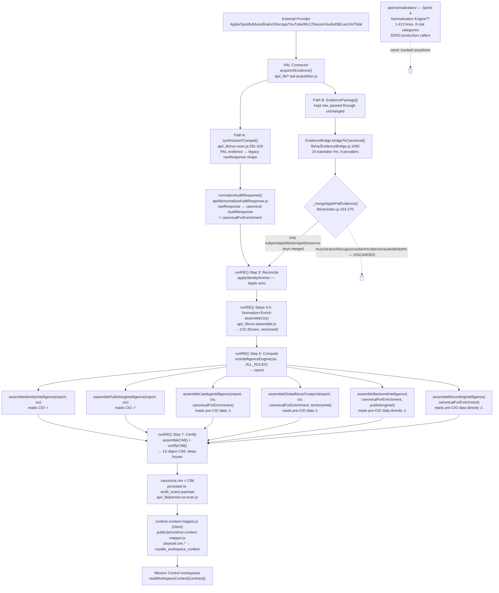

# Royaltē v3.0 Platform Certification™
## Phase 1 — Normalization Layer Certification

**Initiative:** Royaltē v3.0 Platform Certification™
**Phase:** Foundation Certification, Phase 1 of 9
**Status:** Architecture Discovery complete — no code modified, no implementation performed
**Method:** Evidence-based. Every claim below cites a real file and line number. Where a claim could not be verified from the repository, it is marked **UNVERIFIED** rather than assumed.

---

## 1. Executive Summary

The Normalization Layer is not a single module — it is four independently-evolved mechanisms doing overlapping work: a live legacy translator (`normalizeAuditResponse.js`), a live-but-mostly-discarded PAL translator (`EvidenceBridge.js`), a per-provider "compat" synthesizer inside `run-scan.js`, and a fully-built, zero-caller rule engine (`api/normalization/`) that nothing in production ever calls. On top of that, 4 of 9 downstream domain consumers bypass the platform's own canonical object (the CIO) and read pre-normalized data directly — three of which the code's own comments already admit is a violation.

None of this is silent or accidental — the engineers who built this left explicit comments flagging most of it. That is the main reason this certification is 🟡 and not 🔴: the pipeline works end to end today, the canonical objects it produces (CIO, CIM) are each singly-owned, versioned, and immutable, and the team has already demonstrated it can fix this exact class of problem (see the Territory Vocabulary consolidation, cited as a positive control in §8). But "the team already knows" is not the same as "resolved," and the conditions in §11 should close before Mission Control wiring proceeds.

---

## 2. Certification Rating

# 🟡 CERTIFIED WITH CONDITIONS

---

## 3. Executive Certification Summary

### Certification Scorecard

| Category | Status | Why |
|---|---|---|
| Architecture | 🟡 | Real 7-step pipeline (`runRIE()`) exists and runs in production, but normalization itself has no single recognized boundary — split across 4 mechanisms. |
| Data Flow | 🟡 | Traceable end-to-end (Provider → PAL → [two competing translators] → CIO → CIM → Mission Control), but one branch of the flow computes work that is discarded on every scan. |
| Canonical Ownership | 🟢 | CIO and CIM are each produced by exactly one function, at exactly one call site, deep-frozen on creation, and version-stamped. |
| Technical Debt | 🔴 | Currently-executing duplicate computation (not just legacy debt), core logic living in code declared temporary with no replacement built, and a complete unused parallel engine. |
| Duplicate Logic | 🔴 | Confirmed: `EvidenceBridge` translates 9 providers on every scan; only 2 (Apple, Spotify) survive into the canonical object actually used downstream. |
| Platform Readiness | 🟡 | Not broken, not clean. Safe to continue Phase 2 (Identity Intelligence) certification in parallel — Identity Intelligence reads the CIO correctly — but not safe to declare the foundation 🟢. |
| Mission Control Wiring Approval | **Not Approved** | Pending the four conditions in §11. |

### Board Decision

> **Certification Status:** 🟡 Certified with Conditions
>
> The Normalization Layer, taken as the distributed set of mechanisms that actually perform it, is functional and currently sustains production scans without failure. It is not architecturally unsound — it reads as a legitimate strangler-pattern migration caught mid-flight, with the team's own code comments already naming most of the debt described in this report. It is not ready to be called the stable foundation Mission Control wiring should be built on until the conditions below are resolved. Phase 2 (Identity Intelligence) certification may proceed in parallel, since Identity Intelligence is one of the two domain consumers already reading the canonical object correctly.

### Required Actions Before Recertification

- Resolve the duplicate/discarded normalization path between `EvidenceBridge.js` and `run-scan.js`'s compat synthesizers (§8, N1) — one live path per provider, not two.
- Establish a Board-approved replacement plan and target date for `EvidenceBridge.js`, which its own header declares temporary (§8, N2).
- Reconcile the four domain assemblers that bypass the CIO — either migrate them to read the CIO, per the code's own stated intent, or formally re-scope the exception and document it consistently (§8, N4).
- Decide the fate of the dormant, zero-caller `api/normalization/` engine — wire it in, formally document it as reserved future infrastructure, or remove it (§8, N3).
- Lower priority, can trail: implement the CIO's unpopulated confidence-scoring fields (§8, N5); correct `governance/ROADMAP.md`'s stale PAL-migration claim (§8, N6).

---

## 4. Architecture Discovery — Complete Execution Flow

### The chain the Board asked for, as it actually runs today

### Stage-by-stage, with citations

1. **Provider Connectors (PAL).** `api/_lib/run-scan.js:224-249` fans out via `Promise.allSettled` to 10 `acquireXEvidence()` connectors — Apple, Spotify, MusicBrainz, Discogs, YouTube, MLC, Deezer, AudioDB, Last.fm, Tidal (`run-scan.js:40-57`). Each returns `EvidencePackage[]` objects. This confirms **all 10 providers are now PAL-acquired**, not just Apple/Spotify/Deezer as `governance/ROADMAP.md` (last updated 2026-07-17) currently states — the governance record is behind the live code here (see §8, Finding N6).

2. **Two parallel translation paths from the same evidence, from this point on:**
   - **Path A (the one that actually reaches production):** `run-scan.js:291-319` calls `synthesizeXCompat(evidencePackages)` per provider, producing the legacy `rawResponse` shape. This is fed to `normalizeAuditResponse()` (`api/lib/normalizeAuditResponse.js`), the module CLAUDE.md calls "the ONLY place where raw engine field names... are translated to the canonical contract" (`normalizeAuditResponse.js:1-6`). Its output, `canonicalForEnrichment`, is what the rest of the pipeline actually consumes.
   - **Path B (computed, mostly discarded):** the raw `EvidencePackage[]` array is *also* passed to `runRIE()` (`api/audit.js:351-357`) and independently translated by `EvidenceBridge.bridgeToCanonical()` (`lib/rie/EvidenceBridge.js:1095-1131`) — 24 translator function calls covering 9 providers (Apple, Spotify, MusicBrainz, Discogs, YouTube, MLC, Deezer, AudioDB, Last.fm; **no Tidal translator exists** — confirmed by grep, zero matches).

3. **The two paths are reconciled by `_mergeApplePalEvidence()`** (`lib/rie/index.js:233-270`), which merges **only** `bridged.subject`, `bridged.platforms.appleMusic`, `bridged.platforms.spotify`, and `bridged.source` into the Path-A canonical. See Finding N1 (§8) — this is where most of Path B's work is thrown away.

4. **Step 3 — Reconcile:** `applyIdentityAnchor()` (`lib/rie/reconciliation/identity-anchor.js`) is called twice per scan — once for the scanAuthority stamp inside `assembleCIM` (`lib/rie/index.js:205`) and once as the documented Step-3 reconciliation gate (`lib/rie/index.js:378`) — enforcing Apple-as-canonical.

5. **Steps 4-5 — Normalize + Enrich:** `assembleCio()` (`api/_lib/cio-assembler.js:118`) builds the CIO. Its own header is explicit about scope: *"Adapters own provider normalization... CIO owns intelligence"* (`cio-assembler.js:10,12`) — i.e., by the time evidence reaches the CIO assembler, the codebase's own stated intent is that normalization is **already done**. In practice `assembleCio` still performs light shape-guarding (trim, empty-string→null, type checks — e.g. `cio-assembler.js:138-139`) that duplicates logic already in `normalizeAuditResponse.js`'s `_nullableString()` — minor, but it is a third place doing the same kind of work.

6. **Step 6 — Compute:** `runIntelligenceEngine(cio, ALL_RULES)` produces `report`, then seven domain assemblers run independently (`lib/rie/index.js:395-461`), each wrapped in its own try/catch so one failure never blocks another. **Two read the CIO as designed** (`assembleIdentityIntelligence(report, cio)`, `assemblePublishingIntelligence(report, cio)` — `identity-intelligence.js:214`, `publishing-intelligence.js:323`). **Four read `canonicalForEnrichment` directly, bypassing the CIO**: `assembleCatalogIntelligence`, `assembleGlobalMusicFootprint`, `assembleBackendIntelligence` (all three self-flagged in `lib/rie/index.js:52-59` as "Known Phase 3 violations"), plus `assembleRecordingIntelligence` (`lib/recording/recording-intelligence.js:9-15`, reads `canonicalForEnrichment.platforms.*` directly — same pattern, **not** in the code's own violation list). Confirmed live: `api/_lib/backend-intelligence.js:18` documents reading `canonical.platforms.musicbrainz.availability`; line 183's signature is `assembleBackendIntelligence(canonical, publishingIntelligence)`.

7. **Step 7 — Certify:** `assembleCIM()` (`lib/rie/index.js:100-226`) maps every domain object into the 13-object CIM (see §6), then `certifyCIM()` (`lib/rie/certify.js`) validates every §8.2 key is present (throws otherwise) and deep-freezes the result.

8. **Persistence and Mission Control handoff:** the certified CIM is attached as `canonical.cim` and persisted to `audit_scans.payload` (`api/_lib/persist-os-scan.js:216,269-271`). Client-side, `public/js/runtime-context-mapper.js:128-130` reads `payload.cim.identity` (and equivalent CIM fields) into `royalte_workspace_context`, which every Mission Control workspace reads via `readWorkspaceContext({ contract })` (per `governance/MISSION_CONTROL_CONSTITUTIONAL_ARCHITECTURE.md`, verified in the prior session's governance review). This is a fourth, client-side reshaping hop, outside the RIE's own boundary — not itself a defect, but worth the Board knowing it exists when Phase 9 (Mission Control Integration) is certified.

9. **A fifth, completely disconnected mechanism exists and does nothing:** `api/normalization/` — the Sprint 4 "Normalization Engine™" (`api/normalization/NORMALIZATION_ENGINE.md`, 1,413 lines across `index.js`, `pipeline.js`, `registry.js`, `transformers.js`, and 8 `normalizers/*.js` rule files covering text/identity/identifiers/URLs/dates/location/booleans/numeric transforms). It is a complete, well-designed, deterministic, versioned rule engine — and it has **zero callers outside its own test file** (`grep -rln` across `api/`, `lib/`, `public/` returns nothing that imports `api/normalization/index.js`). It was built as Sprint 4 of a 12-sprint Canonical Registry chain that a prior session's repository review (PR #368, per project memory) already confirmed is dormant end-to-end with zero production callers.

---

## 5. Module Inventory

| Module | Purpose | Inputs | Outputs | Consumers | Status | Technical Health |
|---|---|---|---|---|---|---|
| `api/lib/normalizeAuditResponse.js` (603 lines) | The live, primary raw-engine → canonical translator | `rawResponse` (runAudit/run-scan legacy shape) | `AuditResponse` v1.0.0 (`canonicalForEnrichment`) | `api/audit.js`, `lib/rie/index.js`, `lib/rie/CimAdapter.js`, `api/cron/rescan.js`, `api/lib/health-score.js`, `api/_lib/backend-intelligence.js`, tests | **Live, primary path** | Solid. Single-purpose, well-commented, defensive (`_num`, `_nullableString`, `_requireString` guards throughout). One correctness risk: `_computeScore` silently prefers the engine's own `overallScore` when it's within ±2 of the recomputed value (`normalizeAuditResponse.js:487-490`) — a tolerance-based reconciliation baked into a "normalization" function, arguably a Resolution-Engine-shaped decision. |
| `lib/rie/EvidenceBridge.js` (1,146 lines) | PAL `EvidencePackage[]` → `canonicalForEnrichment`-compatible shape, per provider | `EvidencePackage[]` (10 providers) | `bridged` canonical object | `lib/rie/index.js` only | **Live, but ~80% of its output is discarded** (see §8, N1) | Explicitly self-declared **temporary**: *"MIGRATION INFRASTRUCTURE ONLY... NOT part of the permanent Royaltē Operating System... No future functionality may depend upon EvidenceBridge"* (`EvidenceBridge.js:15-34`). 24 translator functions, one per provider-capability pair, each independently try/caught so the bridge itself never throws. |
| `api/_lib/cio-assembler.js` (359 lines) | Restructures already-normalized `canonicalForEnrichment` + publishing/identity-graph sources into the CIO | `scanPayload`, `publishingWorks`, `publishingSourceObservations`, `identityGraph` | CIO (deep-frozen, versioned) | `lib/rie/index.js` (feeds `assembleIdentityIntelligence`, `assemblePublishingIntelligence`, `runIntelligenceEngine`) | **Live, primary path** | Clean, well-governed, explicitly disclaims computing intelligence ("Adapters own provider normalization... CIO owns intelligence" — `cio-assembler.js:10-12`). Deterministic, injectable clock, never throws. Minor overlap: re-implements null/empty-string guarding already done upstream. |
| `api/normalization/` (1,413 lines: `index.js`, `pipeline.js`, `registry.js`, `transformers.js`, `validate.js`, `report.js`, `normalizers/*.js` ×8) | Sprint 4 of the dormant 12-sprint Canonical Registry chain — deterministic, rule-based, versioned, auditable text/identity/identifier/URL/date/location/boolean/numeric normalization | `parsedEvidence` / registry records / envelopes | `{ success, normalizedEvidence, report }` | **None** (self + tests only) | **Dormant. Zero production callers.** | Well-engineered in isolation (idempotency-checked rules, immutable reports, semver'd rules) but entirely disconnected from the live pipeline. A parallel, unused solution to the same problem `normalizeAuditResponse.js`/`EvidenceBridge.js` already solve differently. |
| `lib/publishing/mlc-adapter.js` — `normalizeMlcWork(s)` | Sole owner of MLC response-shape parsing, board-locked | Raw MLC work records | `PublishingWork[]` | `api/audit.js` (`osEnrichmentFn`), `cio-assembler.js` (via `publishingWorks`), Publishing Intelligence domain | **Live, healthy, well-governed** | Model citizen. Explicit constitutional header, "sole owner" rule enforced by convention, pure transformation, deterministic confidence derivation, no speculative scoring (`mlc-adapter.js:1-30`). |
| `lib/recording/recording-normalizer.js` + `lib/recording/title-normalizer.js` | Provider-shape → `NormalizedTrack`; recording-title cleanup for MLC search matching | Raw Spotify/Apple/MusicBrainz/Deezer track shapes; raw titles | `NormalizedTrack`; cleaned title string | `lib/recording/recording-matcher.js`, `recording-confidence.js`, `recording-intelligence.js` | **Live**, scoped to the Recording Intelligence domain only | Clean, pure, well-documented with worked examples. Appropriately narrow scope. |
| `lib/territory/canonical-territory-vocabulary.js` | Single canonical territory/storefront code list | N/A (static vocabulary) | Named constants (`ALL_APPLE_STOREFRONTS`, etc.) | `api/_lib/territory-intelligence.js`, `AppleMusicConnector.js`, `api/territory-scan.js`, `EvidenceBridge.js` | **Live, resolved debt** | A genuine success story: consolidated three previously-independent, byte-verified-identical duplicate lists into one Board-directed canonical source (`canonical-territory-vocabulary.js:1-16`, Phase 5.2). Worth citing to the Board as the template for how the duplication findings in §8 should be resolved. |

**Modules the Board's example list named that were not found as independent normalizers:** Artist Normalization, Release Normalization, Rights Normalization, Distribution Normalization, and Metadata Normalization do not exist as standalone modules. Artist-name/release-shape normalization is folded into `normalizeAuditResponse.js` and `EvidenceBridge.js`; there is no dedicated Rights, Distribution, or Metadata normalizer — `cim.metadata` is explicitly marked `_phase1Stub: true` (`lib/rie/index.js:177`) and sourced from raw `canonicalForEnrichment.issues`/`.modules`, not from any normalization step.

---

## 6. Canonical Object Certification

Two distinct canonical objects exist, at two different points in the pipeline, and they are **not the same thing**:

### CIO — Canonical Intelligence Object (`api/schema/cio.js`, `api/_lib/cio-assembler.js`)

- **Owner:** `cio-assembler.js` — sole assembler, exported factory `assembleCio()`.
- **Version:** `CIO_VERSION = '1.0.0'` (`api/schema/cio.js:185`).
- **Source providers:** `scanPayload` (= `canonicalForEnrichment`, itself already normalized), `publishingWorks`, `publishingSourceObservations`, `identityGraph`.
- **Mapping/transformation logic:** field copy + light type-guard/trim, no computed intelligence (`cio-assembler.js:118-326`).
- **Confidence:** four confidence constants exist (`CIO_CONFIDENCE`, `CIO_ARTIST_CONFIDENCE`, `CIO_PUBLISHING_CONFIDENCE`, `CIO_CATALOG_CONFIDENCE`, `CIO_METADATA_CONFIDENCE`) and **all five are hardcoded to `'UNKNOWN'`** (`api/schema/cio.js:186-190`) — confidence scoring is declared in the schema but not implemented anywhere. **UNVERIFIED whether any downstream consumer reads these fields expecting real values** — worth a follow-up grep before Phase 2 (Identity Intelligence) certification.
- **Evidence:** deep-frozen on assembly (`cio-assembler.js:67-76`); immutability contract enforced, not just documented.
- **Downstream consumers:** `runIntelligenceEngine(cio, ALL_RULES)`, `assembleIdentityIntelligence(report, cio)`, `assemblePublishingIntelligence(report, cio)` only. **Produced exactly once per scan** — confirmed single call site (`lib/rie/index.js:384`).

### CIM — Canonical Intelligence Model (`api/schema/canonical-intelligence-model.js`, `lib/rie/index.js`, `lib/rie/certify.js`)

- **Owner:** `assembleCIM()` (`lib/rie/index.js:100-226`) + `certifyCIM()` (`lib/rie/certify.js`).
- **Version:** `CIM_VERSION = '1.0.0'` (`api/schema/canonical-intelligence-model.js:16`).
- **13 constitutional objects** (§8.2, extended from 12 at Phase 3.7): `identity`, `health`, `globalFootprint`, `catalog`, `verification`, `metadata`, `publishing`, `opportunities`, `actions`, `aiInsight`, `revenueSignals` (reserved, always `{status:'RESERVED', data:null}`), `scanAuthority`, `recording` (`canonical-intelligence-model.js:20-34`).
- **Structural integrity enforced, not just conventional:** `certifyCIM()` throws if any §8.2 key is absent from the object — a present-but-`null` value is valid, a missing key is a hard contract violation (`certify.js:11-13,28-42`). This is a real, verified guarantee, not aspirational documentation.
- **Immutability:** `certifyCIM()` deep-freezes the entire certified object (`certify.js:15-22,44`).
- **Evidence:** `scanAuthority` carries provenance — `sourceProviders`, `evidenceIds`, `connectorVersions` — but **only when the PAL evidence-package path (`lineage`) was used** (`lib/rie/index.js:213-222`); the Phase 1 legacy path produces a CIM with no evidence lineage at all. Since Path A (§4, Stage 2) is what actually reaches production today, **most production CIMs today likely have no evidence lineage** — **UNVERIFIED without querying live `audit_scans` rows**, flagged as a fact-check item rather than assumed.
- **Downstream consumers:** persisted whole to `audit_scans.payload.cim`; Mission Control reads individual `cim.*` fields via the runtime-context-mapper bridge (§4, Stage 8).
- **Produced exactly once per scan** — confirmed single call site (`lib/rie/index.js:465`, invoked once inside `runRIE()`, which is itself documented and enforced as the sole OS entrypoint (`api/audit.js:13-21`)).

**Verdict on "single owner, produced exactly once":** True for both CIO and CIM as objects. **Not true for the normalization step that feeds them** — that step has at least two live implementations (Path A/Path B, §4) running simultaneously on every scan, with Path B's output mostly discarded.

---

## 7. Dependency & Consumer Certification

| Consumer | Reads | Compliant? |
|---|---|---|
| Identity Intelligence™ (`api/_lib/identity-intelligence.js:214`) | `cio` | ✅ CIO only |
| Publishing Intelligence™ (`api/_lib/publishing-intelligence.js:323`) | `cio` | ✅ CIO only |
| Catalog Intelligence™ (`api/_lib/catalog-intelligence.js`, called `lib/rie/index.js:406`) | `cio` **and** `canonicalForEnrichment` | ⚠ Self-flagged violation (`lib/rie/index.js:54,58`) |
| Global Music Footprint™ (`api/_lib/global-music-footprint.js`, called `lib/rie/index.js:418`) | `cio` **and** `canonicalForEnrichment` | ⚠ Self-flagged violation (`lib/rie/index.js:55,58`) |
| Backend Intelligence™ (`api/_lib/backend-intelligence.js:183`) | `canonicalForEnrichment` only (no `cio` param at all) | ⚠ Self-flagged violation (`lib/rie/index.js:56,58`); confirmed live at `backend-intelligence.js:18` |
| Recording Intelligence™ (`lib/recording/recording-intelligence.js`, called `lib/rie/index.js:460`) | `canonicalForEnrichment` only | ⚠ **Not** in the code's own violation list — same pattern, undocumented |
| Territory Intelligence Engine™ (`api/_lib/territory-intelligence.js`, called `lib/rie/index.js:414`) | raw `evidencePackages` directly | ℹ Deliberate, Board-decided exception — explicitly justified in-code as *not* repeating the violation pattern (`lib/rie/index.js:68-74`); reads PAL evidence, not stale canonical, so this is arguably the more correct design, just a third pattern |
| Health Intelligence™, Royaltē AI™, Executive Brief Engine | `healthScore`/`report`/other assembler *outputs* (not raw evidence) | ✅ Compliant by construction — no raw evidence access |
| Mission Control™ workspaces | `royalte_workspace_context` (client-side, post-runtime-context-mapper) | ✅ Never touch raw evidence or CIO/CIM directly (confirmed in prior governance review) |

**5 of 9 domain-level consumers touch pre-normalized/pre-CIO data directly.** Three are self-documented as known, temporary violations awaiting a Phase 3 fix that has not yet landed (no commit or PR reference found for it). One (Recording Intelligence) follows the identical pattern without being catalogued anywhere. Territory Intelligence is architecturally different — a deliberate bypass of the CIO in favor of even-more-raw evidence, which the code explicitly argues is not the same violation.

---

## 8. Technical Debt Assessment

### N1 — Duplicate normalization computed and discarded on every scan (High severity, currently active)

`EvidenceBridge.bridgeToCanonical()` runs 24 translator functions across 9 providers on every single scan (`EvidenceBridge.js:1095-1131`). `_mergeApplePalEvidence()` (`lib/rie/index.js:233-270`) only merges the Apple and Spotify branches into the canonical object that actually reaches the rest of the pipeline. The MusicBrainz, Discogs, YouTube, MLC, Deezer, AudioDB, and Last.fm translations — roughly 19 of the 24 calls — are computed and then thrown away, because `run-scan.js`'s separate `synthesizeXCompat()` path (`run-scan.js:291-319`) already independently normalized the same PAL evidence for those providers into the shape `normalizeAuditResponse()` consumes instead.

**Failure scenario:** this is not a hypothetical risk — it runs on every production scan today. It costs CPU for no product benefit, and it means two independently-maintained normalization implementations exist for 7 providers, with only one of them live. A future engineer fixing a MusicBrainz field-mapping bug has to know which of the two normalizers is the one that matters — the code gives no signal that `EvidenceBridge`'s MusicBrainz translator is dead weight.

### N2 — Core normalization logic lives in code marked for deletion (High severity)

`EvidenceBridge.js`'s own header declares it "MIGRATION INFRASTRUCTURE ONLY... NOT part of the permanent Royaltē Operating System... No future functionality may depend upon EvidenceBridge" (`EvidenceBridge.js:15-34`). Yet it is the only structural translator for 9 of 10 providers' PAL evidence, and (per N1) is the *sole surviving path* for Apple and Spotify's PAL-native evidence today — the two providers whose evidence Path B actually contributes. There is no visible replacement module or migration plan target for what takes over EvidenceBridge's job once it is removed.

### N3 — A fully-built, zero-caller alternative normalization engine (Medium severity — waste, not risk)

`api/normalization/` (1,413 lines, Sprint 4 of the dormant Canonical Registry chain) is complete, tested in isolation, and never invoked in production (§4, Stage 9). This is real engineering effort sitting unused, solving a problem the platform already solves two other ways. It is not currently a *risk* (nothing depends on it, so it can't break anything), but it is technical debt in the sense the Board asked about: it will confuse any future audit that doesn't already know it's dormant, and its existence alongside `EvidenceBridge`/`normalizeAuditResponse` raises the question of which one the platform is actually supposed to converge on.

### N4 — Four domain assemblers bypass the canonical object (Medium-High severity)

Catalog, Global Music Footprint, Backend, and Recording Intelligence all read `canonicalForEnrichment` directly instead of the CIO (§7). Three are self-documented as known debt; Recording Intelligence is not. Practical consequence: if `normalizeAuditResponse.js`'s output shape changes, four domain assemblers have a direct dependency on it that the CIO's abstraction boundary was specifically designed to prevent.

### N5 — Undifferentiated confidence field (Low-Medium severity)

All five CIO confidence constants are hardcoded to `'UNKNOWN'` (`api/schema/cio.js:186-190`). The schema promises per-domain confidence; nothing populates it. **Not yet verified** whether any Mission Control surface displays or depends on these fields — recommended as a fast follow-up check before Identity Intelligence (Phase 2) certification, since Identity Intelligence is the first consumer that reads the CIO directly.

### N6 — Governance record understates PAL migration progress (Low severity, but relevant to how the Board should weigh this report)

`governance/ROADMAP.md` (last touched 2026-07-17) states "All original streaming providers (Apple, Spotify, Deezer) now 100% migrated to PAL." Live code shows all 10 providers acquired via PAL connectors (`run-scan.js:224-249`). The Board's mental model of "how much of the platform is on the new architecture" is currently more pessimistic than the code — worth correcting, since it affects how urgent Finding N1/N2 should be judged (more providers on PAL means more surface area currently subject to the duplicate-normalization problem, not less).

### Not technical debt — cited as a positive control

`lib/territory/canonical-territory-vocabulary.js` is what resolved duplication looks like in this codebase: three independently-maintained, byte-verified-identical lists were consolidated into one Board-directed canonical source with the old duplication documented in the file header rather than silently deleted (`canonical-territory-vocabulary.js:1-16`). `lib/publishing/mlc-adapter.js` is the model for a well-governed single-owner normalizer. Both are evidence the team can and does fix exactly this class of problem when a Board decree targets it directly — which is the basis for this report's 🟡 rather than 🔴 rating.

---

## 9. Certification Assessment

### Existing Architecture

A real, live, single-entrypoint intelligence pipeline exists (`runRIE()`), documented against a formal 7-step model (Collect → Validate → Reconcile → Normalize → Enrich → Compute → Certify), producing a version-stamped, deep-frozen, structurally-validated 13-object CIM that Mission Control consumes exclusively through a client-side context bridge. Two canonical objects (CIO, CIM) each have exactly one producer. Two domain-specific normalizers (MLC, Territory Vocabulary) are genuinely well-governed and should be held up as the pattern to replicate.

### Missing Components

- No single, board-recognized "Normalization Layer" module — the responsibility is split across `normalizeAuditResponse.js`, `EvidenceBridge.js`, `run-scan.js`'s per-provider compat synthesizers, and `cio-assembler.js`'s light re-guarding, with no shared contract between them.
- No confidence-scoring implementation behind the CIO's confidence schema fields (all hardcoded `'UNKNOWN'`).
- No dedicated Rights, Distribution, or Metadata normalizer — `cim.metadata` is an explicit `_phase1Stub`.
- No replacement plan visible for `EvidenceBridge` despite it being marked for eventual removal.

### Architectural Risks

- **Scalability risk:** every new provider added to PAL currently requires *two* translator implementations to stay in sync by convention alone (a `synthesizeXCompat()` in `run-scan.js` and a `translateX()` set in `EvidenceBridge.js`) — only one of which is guaranteed to reach production, with no compiler or test enforcing that developers know which. This does not scale cleanly to Phase 2-8 of this certification if each intelligence module inherits the same pattern.
- **Silent correctness risk:** because `EvidenceBridge` translator failures are individually try/caught and swallowed (`EvidenceBridge.js:1098-1129`), and because most of its output for 7 providers is discarded anyway (N1), a broken translator for e.g. Discogs could sit broken indefinitely with zero observable effect — nothing currently depends on that code path succeeding.
- **Boundary erosion risk:** N4's four direct-read consumers mean the CIO's stated purpose ("Consumers never bypass the Assembly Engine" — `cio-assembler.js:14`) is already violated by nearly half of the domain assemblers Phase 2-8 of this certification will need to evaluate individually.

---

## 10. Findings (ranked)

1. **N1** — duplicate, wasted normalization work on every scan (fix: either wire the discarded EvidenceBridge output in, or delete the dead translator calls — both are legitimate, but "neither" is the current unstable state).
2. **N2** — permanent logic living in code declared temporary, no replacement built.
3. **N4** — four assemblers bypassing the CIO.
4. **N3** — dormant Sprint 4 engine; clean up or formally document as reserved future infrastructure.
5. **N5** — unimplemented confidence scoring.
6. **N6** — governance doc lag (cheap fix, update ROADMAP.md).

---

## 11. Required Actions

- **Condition 1:** Resolve N1 — either the discarded EvidenceBridge translations for MusicBrainz/Discogs/YouTube/MLC/Deezer/AudioDB/Last.fm are wired into the canonical object, or the dead calls are removed, so there is exactly one live normalization path per provider.
- **Condition 2:** Resolve N2 — a Board-approved plan and target date for what replaces EvidenceBridge, and when.
- **Condition 3:** Resolve N4 — either move the four consumers to read the CIO (per the code's own stated Phase 3 intent) or formally re-scope the violation as permanent and document it consistently, so the next certification phases (which will individually certify Catalog, Backend, Global Footprint, and Recording Intelligence) know which standard they're being held to.
- **Condition 4 (lower priority, can trail):** N3, N5, N6.

---

## 12. Final Certification Rating

# 🟡 CERTIFIED WITH CONDITIONS

Not 🔴 — the pipeline is coherent, functioning, and produces singly-owned, immutable, versioned canonical objects; the team has already demonstrated it can resolve this exact class of debt (Territory Vocabulary). Not 🟢 — real, currently-executing duplicate computation and undocumented CIO-bypass consumers mean the foundation is not yet stable enough to certify as ready for full platform wiring.

---

## 13. Board Decision

> The Normalization Layer, taken as the distributed set of mechanisms that actually perform it, is functional and currently sustains production scans without failure. It is not architecturally unsound — it reads as a legitimate strangler-pattern migration caught mid-flight, with the team's own code comments already naming most of the debt described in this report. It is not ready to be called the stable foundation Mission Control wiring should be built on until the four conditions in §11 are resolved. Phase 2 (Identity Intelligence) certification may proceed in parallel, since Identity Intelligence is one of the two domain consumers already reading the canonical object correctly — but its certification should explicitly check Finding N5 (unpopulated CIO confidence fields) as part of that work, since Identity Intelligence is the first consumer that reads the CIO directly.

---

## 14. Recommended Next Certification

**Phase 2 — Identity Intelligence™**, per the Board's stated audit order. Recommended focus areas carried forward from this report, so Phase 2 doesn't have to rediscover them:

- Confirm whether `cio.identity`'s confidence-adjacent fields are read anywhere in Identity Intelligence's own logic, given N5 (all CIO confidence constants are hardcoded `'UNKNOWN'`).
- Confirm whether Identity Intelligence is affected by N1 — since Apple and Spotify are the two providers whose EvidenceBridge translations *do* survive the merge, Identity Intelligence is the domain most directly exposed to Path A/Path B divergence if the two ever disagree.
- Verify the `scanAuthority` evidence-lineage gap noted in §6 (CIM) against live `audit_scans` data, since Identity Intelligence is adjacent to `scanAuthority` in the CIM and the Board may want lineage completeness as part of Identity's own certification.

---

*This document was produced under Board directive: no code was modified, refactored, or optimized in the course of this certification. Every finding above traces to a specific file and line in the repository as of the `main` branch at commit `f71f497`.*
