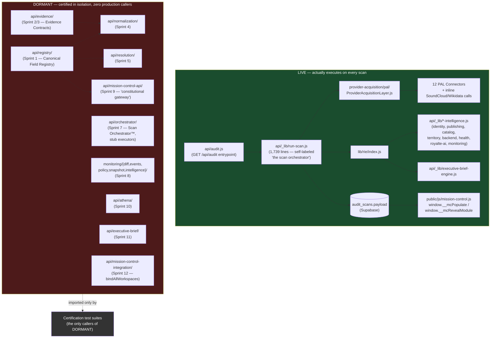

# Platform Architecture — As Built — ROYALTĒ v3.0 §2 — Discovery

**Status:** DISCOVERY ONLY. This document reconciles what governance has previously *documented/ratified* as the platform's architecture against what the 2026-07-18 audit found *actually executes in production*. It does not change, retire, or endorse either stack — see `PLATFORM_REFACTORING_SUMMARY.md` §1 for the Board decision this reconciliation depends on.

## 1. Why This Document Exists

Existing governance documents (`governance/BOARD_DECISIONS.md`, `governance/ROADMAP.md`, and each Sprint's own completion report) describe the Sprint 1–12 stack as the platform's architecture, ratified sprint by sprint, "constitutionally complete" as of Sprint 12 (PR #322). Read on their own, they accurately describe what was built and certified. Read as a description of *what runs when an artist submits a scan*, they are misleading — none of that stack is on the live path. This document is the missing "as-built" reconciliation.

## 2. Diagram — Both Stacks

No solid arrow crosses between the two subgraphs. The only edges into `DORMANT` originate from `tests/`.

## 3. Reconciliation Table — Documented vs. Actual

| Governance claim | Source | Actual (2026-07-18 audit) |
|---|---|---|
| "Mission Control Data API™... constitutional gateway: no app may call platform engines directly" | `BOARD_DECISIONS.md:88`, project memory `project_royalte_mission_control_api_lock.md` | No app calls the gateway either. The live frontend reads `audit_scans.payload` directly from Supabase, bypassing the gateway entirely. |
| "Scan Orchestrator™... sole component authorized to execute the complete scan pipeline" | `BOARD_DECISIONS.md:140`, project memory `project_royalte_scan_orchestrator_sprint7_lock.md` | `api/_lib/run-scan.js` executes the entire live pipeline and refers to itself as "the scan orchestrator" in its own comments, with no relationship to `api/orchestrator/`. |
| "Core Platform Architecture constitutionally complete" (Sprint 12) | project memory `project_royalte_mc_integration_lock.md` | Complete and certified on its own terms; zero production wiring. `bindAllWorkspaces()` is never called. |
| "One Health Engine" — single computeHealthScore entrypoint | project memory `project_royalte_health_engine_lock.md` | Live path uses `api/_lib/health-engine.js`; a second, older `api/lib/health-score.js` (`computeV2HealthScore`) remains in the tree with zero callers, superseding note notwithstanding. |
| Territory Intelligence — sole Apple Music provider, single engine (Phase 5.2/5.4) | project memory `project_royalte_health_engine_lock.md`, `project_royalte_phase_5_4_...` | **Confirmed accurate.** This is the one ratified subsystem in this audit's scope that is both documented correctly and actually live (`api/_lib/territory-intelligence.js`, called from `lib/rie/index.js`). |
| Engine Provider Registry™ — governance-only, additive, doesn't touch runtime | `governance/ENGINE_PROVIDER_REGISTRY_COMPLETION_REPORT.md` | **Confirmed accurate on its own terms** — but the registry file itself (`EngineProviderRegistry.js`) has zero importers of its own five query functions; it functions purely as documentation, which appears to be its intent. |

## 4. What Should Change About How Future Governance Docs Are Written

Not a code recommendation — a documentation-process one, offered for the Board's consideration alongside `PLATFORM_REFACTORING_SUMMARY.md`:

Every Sprint 1–12 completion report states "N/N assertions passed" as its primary success signal. That's necessary but was evidently treated as sufficient — none of those reports state, as a separate explicit check, "and here is the production entrypoint that now calls this." The Engine Provider Registry completion report (§1, most recent) is the one exception in this codebase: it explicitly documents its file as intentionally non-runtime, governance-only, so its lack of a production import is correct-by-design rather than an oversight. Future "Section" completion reports could adopt that same explicit intentional-scope statement — "this is wired into production at `X`" or "this is intentionally not wired, per Y" — so the next platform audit doesn't have to independently re-derive it via grep.
